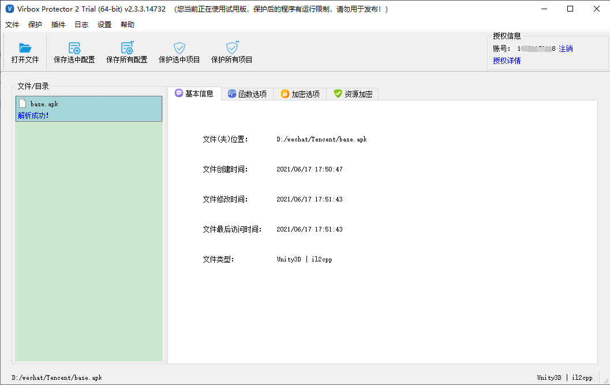
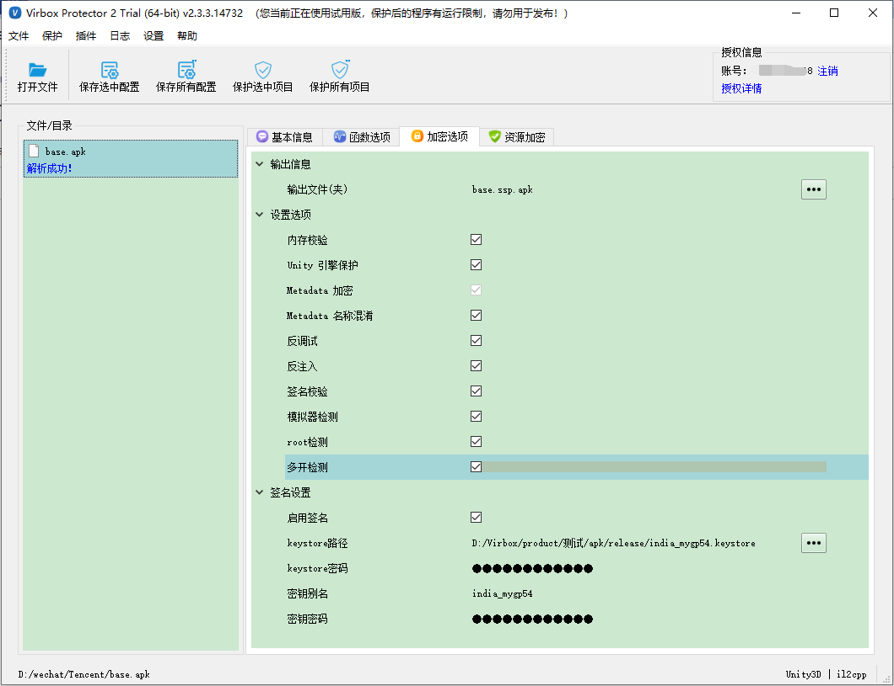
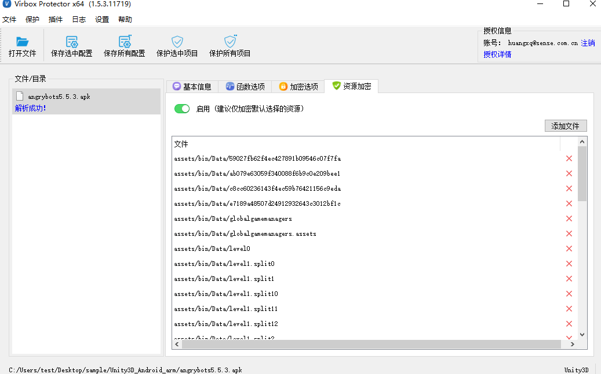

# Android Unity3D APK 加固流程

Android Unity3D APK 分两种编译模式，il2CPP 和 Mono，Virbox Protector 2 支持这两种编译模式的 APK/AAB 的保护，加密过程仅在加密选项的设置略有不同。

------

本文以 base.apk 为例。编译模式：il2cpp。

### 1、将目标APK程序拖入到加壳工具界面

### 2.设置加密选项

#### 设置选项

- **内存校验：**运行时对 il2cpp Native 模块进行完整性校验，防止代码逻辑被篡改。
- Unity引擎保护：保护Unity引擎，增强安全性
- metadata加密：加密 il2cpp 的 global-meta-data 文件，并对内部结构进行混淆处理，防止运行时在内存中直接解析。
- metadata名称混淆“：对 il2cpp 的 global-meta-data 文件中的方法名进行混淆处理。
- 勾选反调试按钮，则使用IDA等调试工具调试时，程序会直接退出。
- 勾选签名校验按钮，且进行签名设置，输入自己的keystore文件和密码（密钥别名和密钥密码选填）
- 勾选反注入，可以防止其它进程对 APK或aab 进程附加调试或注入。
- 勾选模拟器检测，可以防止程序在“夜神”“雷电”等模拟器中运行。
- 勾选root检测，可以防止程序在root过后的手机上运行。
- 勾选多开检测，可以防止程序多开分身。

#### 签名设置

启用签名：勾选启用签名，需要设置keystore路径和keystore密码，加密后会自动签名。如果不勾选启用签名，加密后的apk需要重新做签名。

### 3. 设置资源加密

可以直接在资源加密选项处点开启用按钮，可以对Unity3D中的资源文件进行加密保护。

### 4、点击 保护选中项目

点击 保护选中项目 即可保护成功，加密成功后会生成ssp.apk是加密后的apk程序。

**保护完成后，生成的文件：**

base.apk     原文件

base.apk.ssp  加固时生成的配置文件，保存加密时所有设置选项。

base.ssp.apk  加固后的 apk 文件

