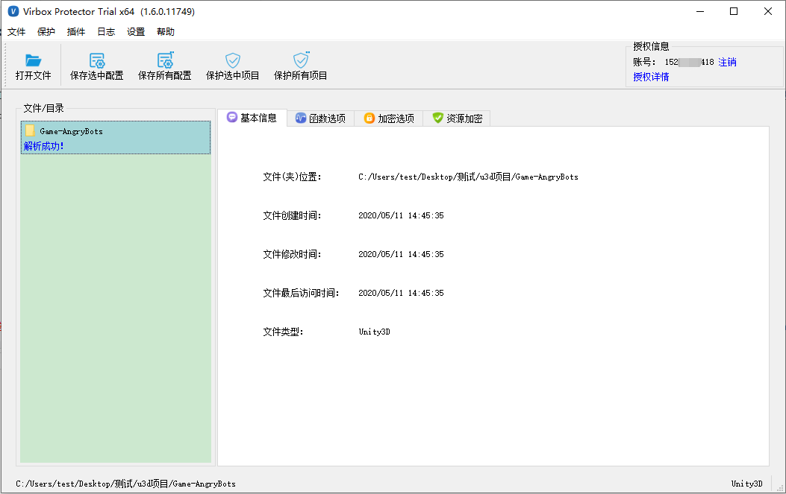
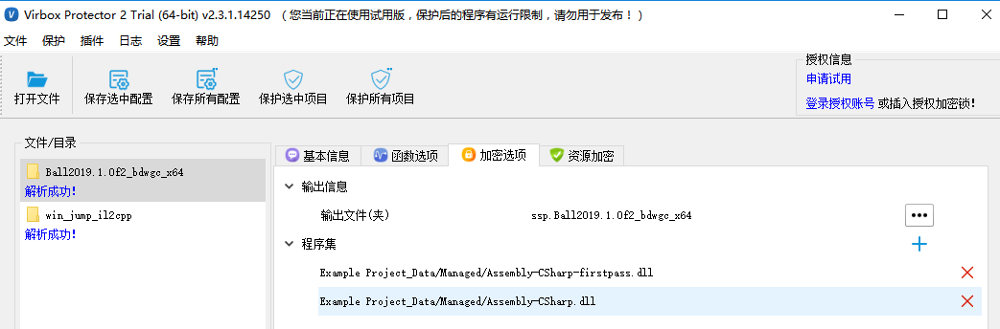
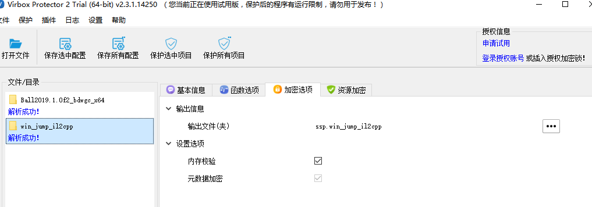
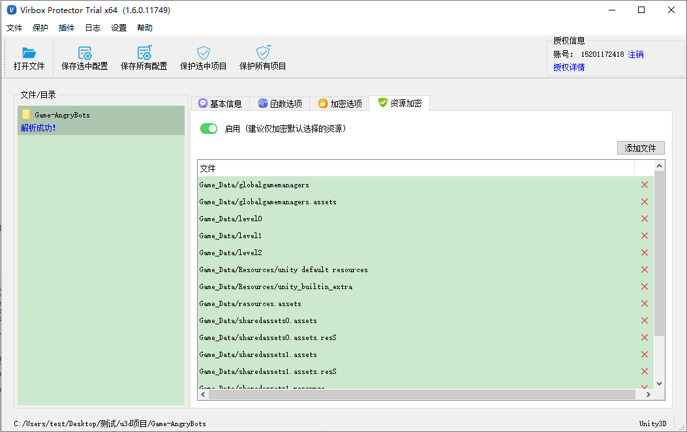
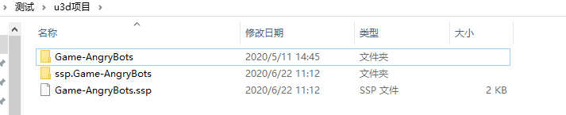

# Windows/Linux Unity3D程序加密流程

对于Unity3D的保护方式，主要是通过Virbox Protector 对Unity3D程序的整个生成目录进行加密，可以保护Unity的主要代码逻辑不被反编译，最大程度保护软件开发商的合法权益，同时可以对Unity软件中的 .resS和resources等资源文件进行加密防止软件或游戏中的资源被非法提取。

## 操作流程

1.将程序拖入Virbox Protector

2.设置加密选项

3.设置资源加密

4.点击保护选中项目

5.加密效果查看

------

## 加密流程

### 1.将程序拖入Virbox Protector

将Unity3D程序的整个目录拖入 Virbox Protector 中

### 2.设置加密选项

**输出信息：**加密选项处输出文件夹会自动写成【ssp.程序名】

**mono格式**：加密选项处默认会加载程序中的Assembly-CSharp.dll和Assembly-CSharp-firstpass.dll文件，也可以添加Managed目录下自主开发的C# 程序集;

**il2cpp格式**：加密选项处默认对元数据（global-metadata.dat）进行保护；

### 3.设置资源加密

点击资源加密，将启用按钮打开。Virbox Protector会将资源文件加载进来，也可点击添加文件添加其他资源文件。【注】资源加密选项建议仅加密默认选择的资源。

### 4.点击保护选中项目

点击【保护选中项目】，提示加壳成功，打开生成目录，默认是在原文件的同目录下生成新的ssp.XXX（Unity3D程序文件夹名称），加密成功。

