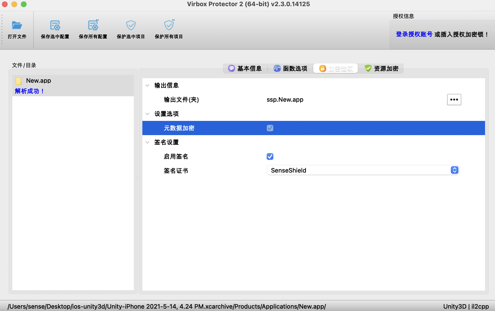
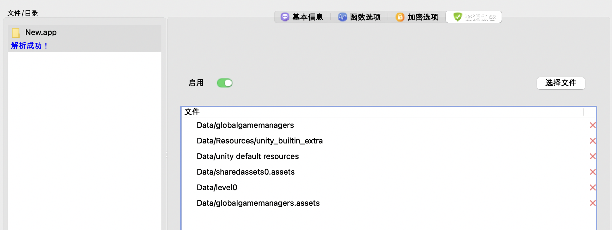

# iOS Unity3D app 保护流程

## 方案简介

支持对 iOS 系统运行的 Unity3D app 的保护。

:::caution 温馨提示

针对于iOS Unity3D程序，需要生成 xcarchive 包；

:::

## 使用流程

1、将xcarchive\Products\Applications里的app程序直接拖入到加壳工具界面；

2、加密选项：勾选启用签名，可以对保护后的程序自动进行签名；

:::caution 注意

当前版本签名设置未生效，加固之后请用 iOS App Signer 签名

:::

3、资源加密：点击“启用”按钮，可以对资源文件进行保护；

4、点击“保护选中项目”或“保护所有项目”对目标app进行保护。

:::caution 温馨提示

若是在xcarchive包里，可以直接对app进行保护。
若是将目标app单独拷贝出来，则dSYM文件需和目标app放在同一目录，才能保护成功。

:::
