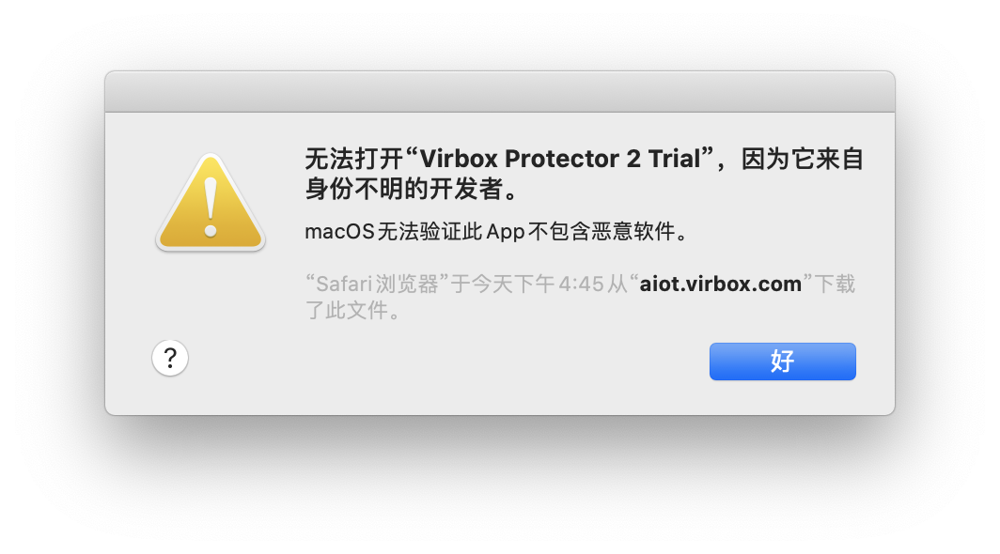
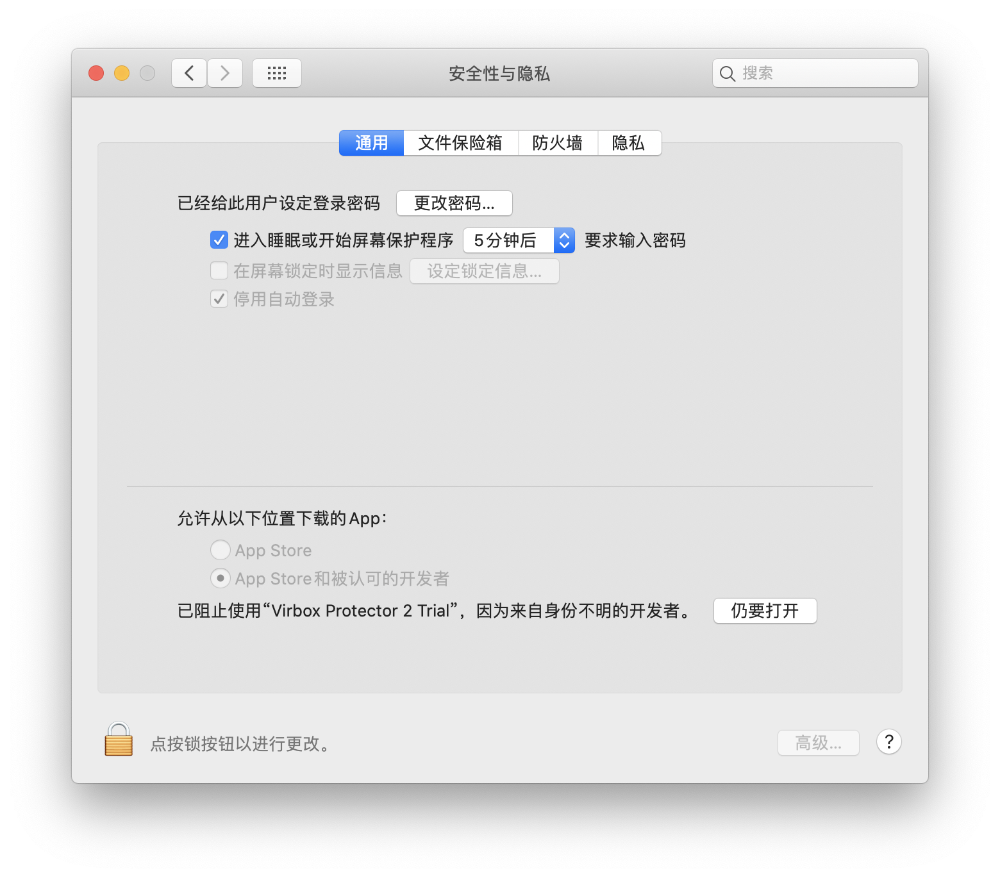
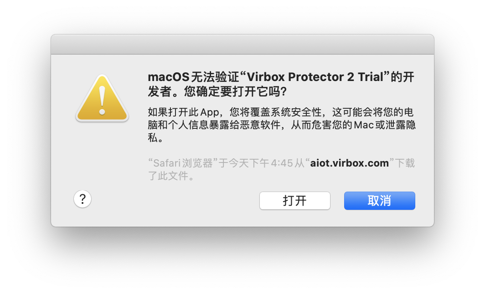

# 安装

Virbox Protector 支持安装在 Windows、Linux及 macOS 电脑上做加密。

------

## ♣ Windows 下安装

下载 Windows 安装包，双击安装包即可安装。 

------

## ♣ Linux 下安装

启动终端，在安装文件保存目录中启动终端。使用如下命令，进行安装。注意：需要在root权限安装。

```
Centos 安装命令 ：rpm -ivh virboxprotector_trial_2.3.3.14630.rpm

Ubuntu 安装命令 ：dpkg -i virboxprotector_trial_2.3.3.14630.deb

// 安装完成后，需要登录账号 13888888888需换成自己的账号
登录命令：ssclt -c all -u 13888888888
```

------

## ♣ macOS 下安装

Virbox Protector 2 提供了 PKG安装包格式，下载后，可以直接双击 pkg 文件进行安装。

注意

如果您的Mac电脑是 M1 系列电脑，在登录的时候如果出现问题，请联系我们的客服。

双击 Virbox Protector 2 Trial ，可能会弹出一个警告对话框，这是由于开发者未向 Apple 注册导致的，并不意味着应用有问题。



打开「设置」，选择「安全性与隐私」，点击**仍要打开。**

****

进入确认窗口，点击打开，解除限制。

