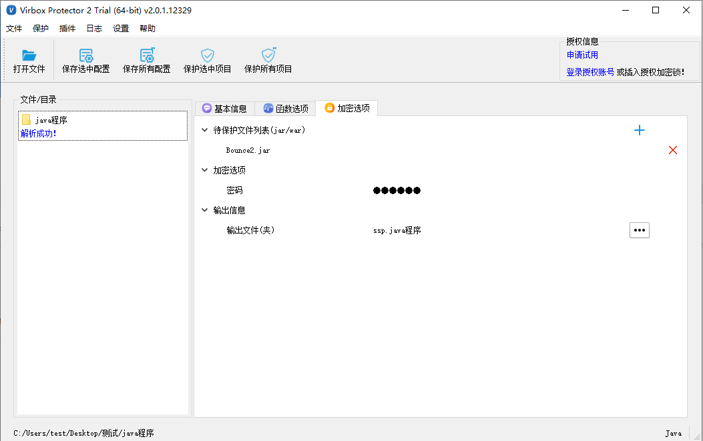
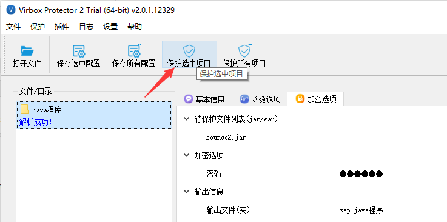
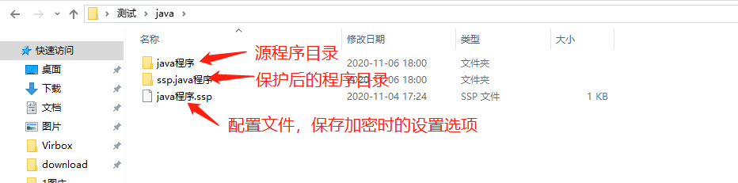
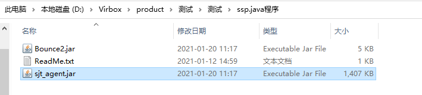
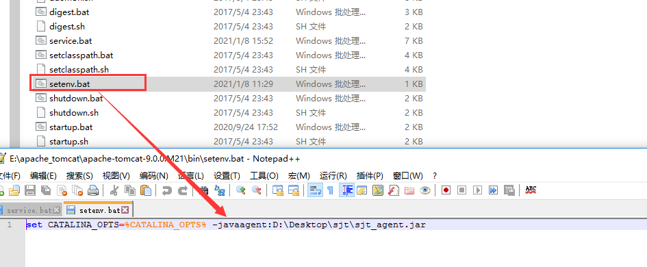
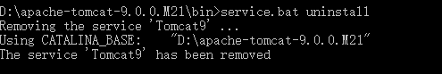
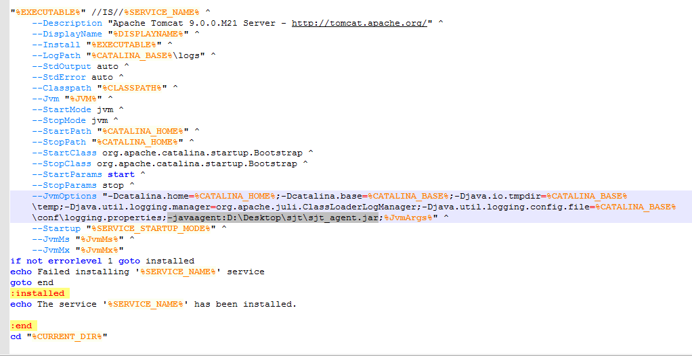
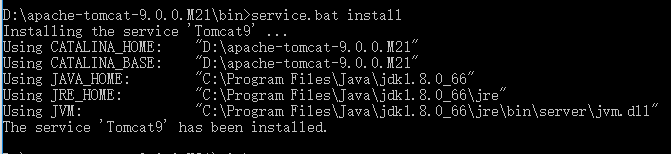
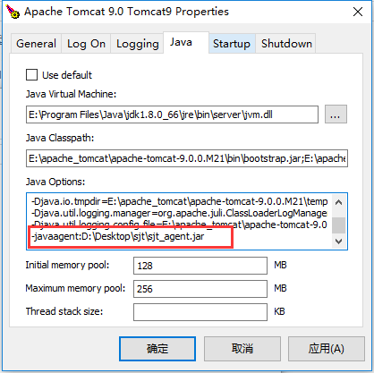
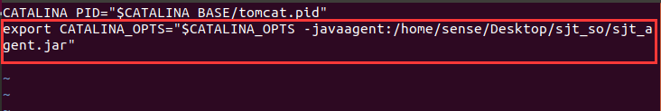

# Java BCE 加密流程

## 方案简述

本文档适用于 VirboxProtector-BCE 保护方式，版本：2.1.0.13081及以上版本

使用 Virbox Protector Java BCE 版可直接将包含 jar、war 包的文件夹拖入到保护工具里，点击保护选中项目即可，保护后会生成加密后的 jar 、war 包及 sjt_agent.jar。

## 1.准备工具

将待加密的jar包放到一个文件夹中。


## 2.添加目录

将包含jar包的目录拖入工具中，设置加密选项中的密码



加密选项-密码设置

- 密码如果不设置，会随机默认密码。
- 建议设置一个密码，并牢记，后续更新jar包时，重新加密时填写此密码，则无需更换配置sjt库。

## 3.点击保护

点击【保护选中项目】，保护成功后会重新生成一个目录：ssp.java程序 ，里面包含加密后的jar包和 sjt 文件。



下图：点击保护选中项目，生成保护后的程序目录和配置文件。



下图为保护后的程序目录中的文件：**加密后的jar包及sjt_agent.jar文件**。



## 4. 运行加密后的jar包/war包

### Jar包运行

在运行jar包时指定sjt_agent.jar文件目录。

#### **Windows 系统**

**运行方式：运行jar包时指定sjt文件目录**

1）若 sjt_agent.jar 和 jar 包在同一目录，进入到jar包的当前目录下，直接执行

```
命令：java -javaagent:sjt_agent.jar -jar ***.jar
```

2）若 sjt_agent.jar 和 jar包 不在同一目录，需要指定文件的全目录。

```
命令：java -javaagent:C:\Users\test\Desktop\sjt\sjt_agent.jar -jar ***.jar
```

#### **Linux 系统**

**运行jar包时指定sjt文件目录**

**若 sjt_agent.jar 和 jar 包在同一目录，进入到 jar 包的当前目录下，直接执行。**

```
命令：java -javaagent:sjt_agent.jar -jar ***.jar
```

**若 sjt_agent.jar 和 jar 包不在同一目录，需要指定文件的全目录。**

```
命令：java -javaagent:/home/sense/Desktop/sjt_so/sjt_agent.jar -jar ***.jar
```

#### macOS 系统

**运行jar包时指定sjt文件目录**

**若 sjt_agent.jar 和 jar 包在同一目录，进入到 jar 包的当前目录下，直接执行。**

```
命令：java -javaagent:sjt_agent.jar -jar ***.jar
```

**若 sjt_agent.jar 和 jar 包不在同一目录，需要指定文件的全目录。**

```
命令：java -javaagent:/home/sense/Desktop/sjt_so/sjt_agent.jar -jar ***.jar
```


### War包运行

#### Windows下部署

分三种情况，您可以根据实际运行情况选择其中一种运行方式。

------

##### 1.tomcat目录下设置setenv.bat

1）在tomcat\bin目录下新建setenv.bat，文件中设置环境变量比如，set CATALINA_OPTS=%CATALINA_OPTS% -javaagent:sjt_agent.jar 的全路径，如图所示：



2）将保护后的war包放入到 `.\apache-tomcat\webapps` 文件夹中，直接启动tomcat服务即可运行。

##### 2.启动tomcat时在服务中启动

1）首选需要将tomcat服务给卸载，控制台命令service.bat uninstall；



2）在service.bat里的JvmOptions参数里加上 sjt_agent.jar，如图所示：



3）然后在控制台命令行里service.bat install；



4）然后服务里启动tomcat ；

5）将保护后的war包放入到 `.\apache-tomcat\webapps` 文件夹中，直接启动tomcat服务即可运行。

##### 3. 直接使用tomcat9.exe启动服务

1）首先启动tomcat9w.exe；

2）在Java Options操作列表添加sjt库，如图所示：



3）然后运行tomcat9.exe启动tomcat服务，将保护后的war包放入到 `.\apache-tomcat\webapps` 文件夹中，直接启动tomcat服务即可运行。

------

#### Linux 下部署

tomcat目录下设置setenv.sh

1）在tomcat\bin目录下新建setenv.sh，文件中设置环境变量比如 export CATALINA_OPTS="$CATALINA_OPTS -javaagent:/home/sense/Desktop/sjt_so/sjt_agent.jar"的全路径，如图所示：



2）启动tomcat服务，可以查看到设置的CATALINA_OPTS参数。


3）将保护后的war包放入到 `.\apache-tomcat\webapps` 文件夹中，tomcat服务正常解析war包，网页即可运行。

------

#### macOS系统

1、在tomcat/bin目录下新建setenv.sh，文件中设置环境变量比如 CATALINA_OPTS="$CATALINA_OPTS -javaagent:/Users/sense/sjt/sjt_agent.jar"。
2、启动tomcat服务，可以查看到设置的CATALINA_OPTS参数。
3、将保护后的war包放入到 .\apache-tomcat\webapps 文件夹中，tomcat服务正常解析war包，网页即可运行。

