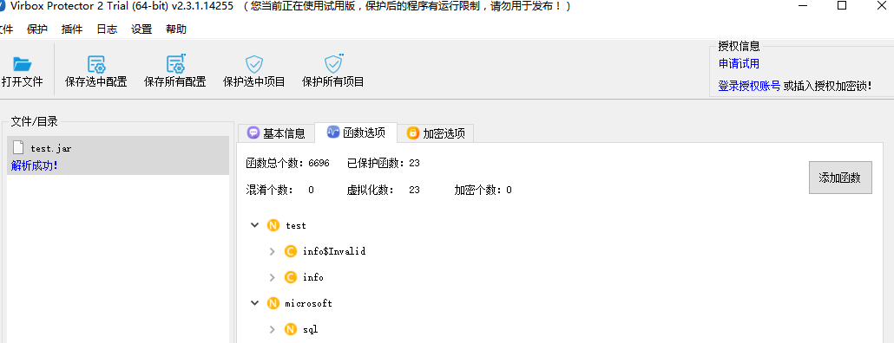
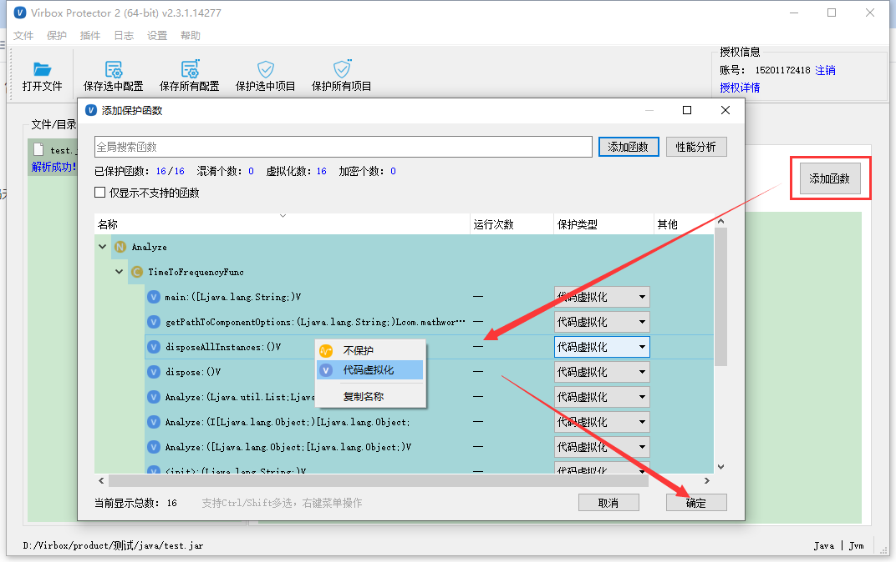
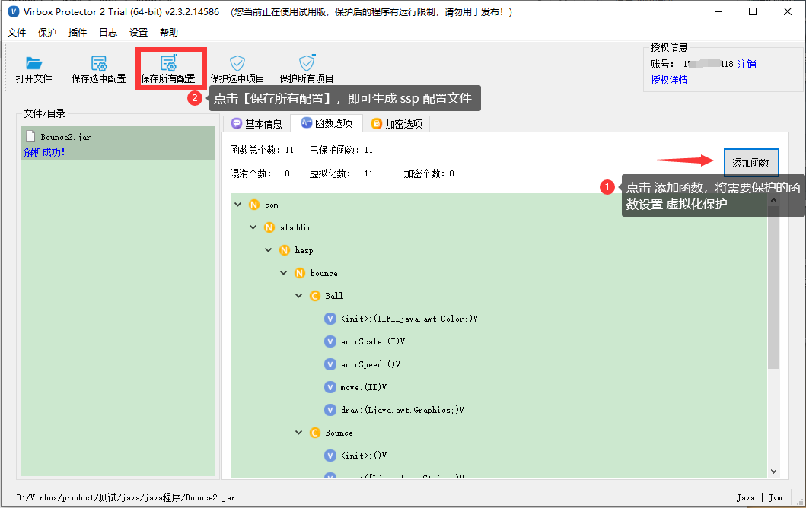
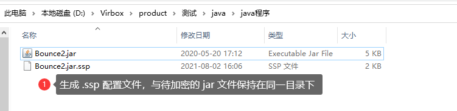
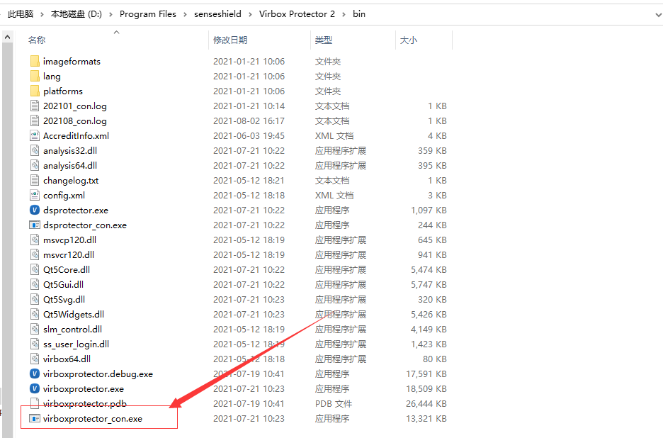
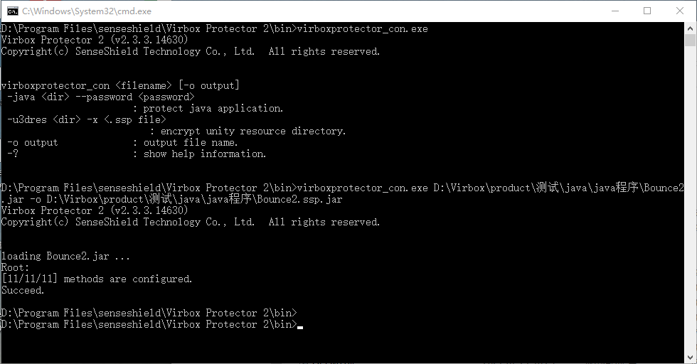

# Java VME 加密流程

## 方案简述

Virbox Protector Java VME 保护技术是将 Java 方法的字节码转换为自定义的虚拟机字节码，并将其替换为跳转代码，运行时跳转至自定义虚拟机中解释执行，安全强度高，无法被任何已知工具还原出原始 Java 代码。

使用 Virbox Protector Java VME 版可直接将 jar/war 包拖入到保护工具里，函数选项处，点击添加函数，选择函数设置保护方式为虚拟化；点击保护选中项目即可，即可对 jar /war 包进行保护，保护后，程序正常使用即可。

与 Java BCE 的不同

1.  加密方式不同：VME 可对 Java 方法进行虚拟化保护，BCE 方式是加密 Class 文件中每个方法的 Java 字节码，运行时在 Java agent 中动态解密。
2.  加密后运行方式不同：VME 加密后 jar包运行方式与未加密时一致，BCE 加密后运行时，需要配合使用 sjt_agent.jar。
3. 加密方式不同：VME直接对 jar/war 包进行加密，BCE 需要把 jar/war 放到文件夹，然后把文件夹添加到 加壳工具中。
4. VME 支持 Jar 包二次调用的加密场景，BCE 不支持此类场景保护。

------

## 界面加密流程

### 1.将jar包直接拖入到工具中；

### 2.设置函数选项

在函数选项处，点击【添加函数】，选择函数，设置保护方式为虚拟化，确定。

### 3.点击保护

点击【保护选中项目】，保护成功后会重新生成加密后的jar包和ssp文件

注意

test.jar    为源文件jar包

test.ssp.jar 为加密后的jar包

test.jar.ssp 为加密设置时保存的配置选项文件

## 命令行保护方式

1.使用Virbox Protector界面工具生成配置文件；

在函数选项里，设置函数的保护方式，然后点击 【保存所有配置】，会生成一个 xx.jar.ssp 文件，将 ssp 配置文件与待加密的 jar 包放在同一个目录里。

2. 打开终端窗口，进入到“virboxprotector_con”所在的路径，直接输入“virboxprotector_con”运行可查看帮助信息；

可在 Virbox Protector 快捷方式上，鼠标右键 选择 打开文件所在位置，即可进入到“virboxprotector_con”所在的路径

3. 加密 jar 执行命令如下：

virboxprotector_con <需要被保护的jar> -o <输出文件的jar>

