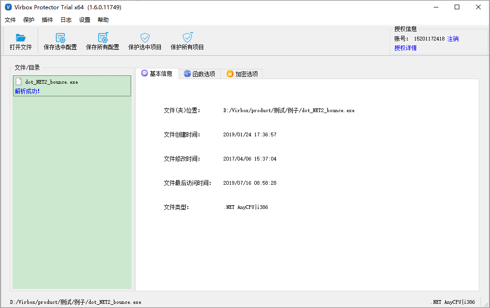
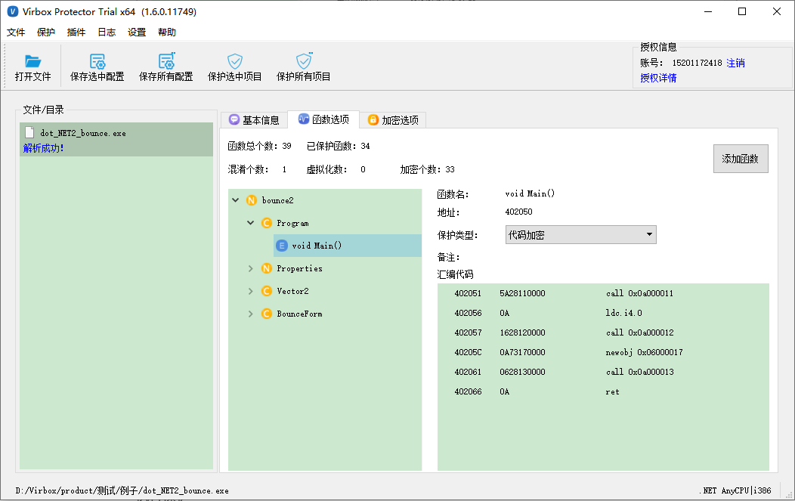
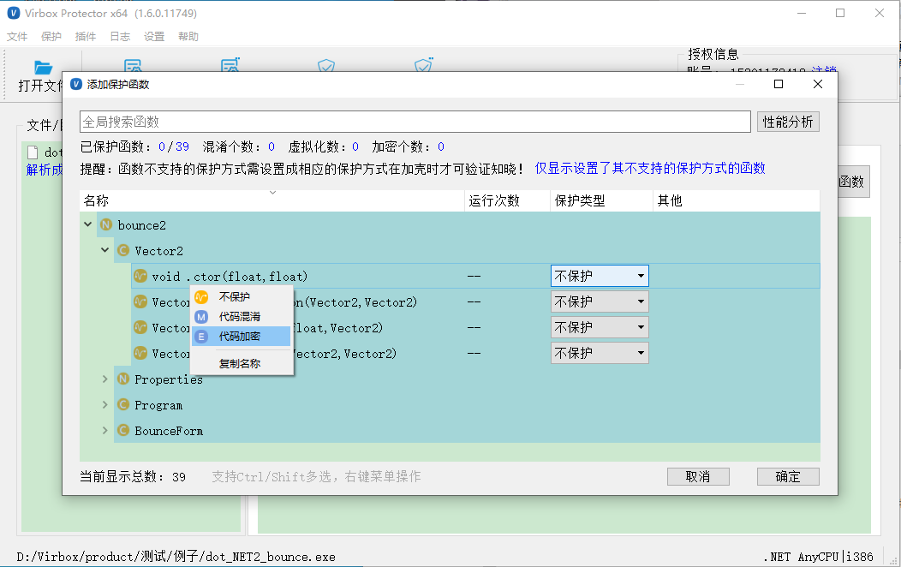
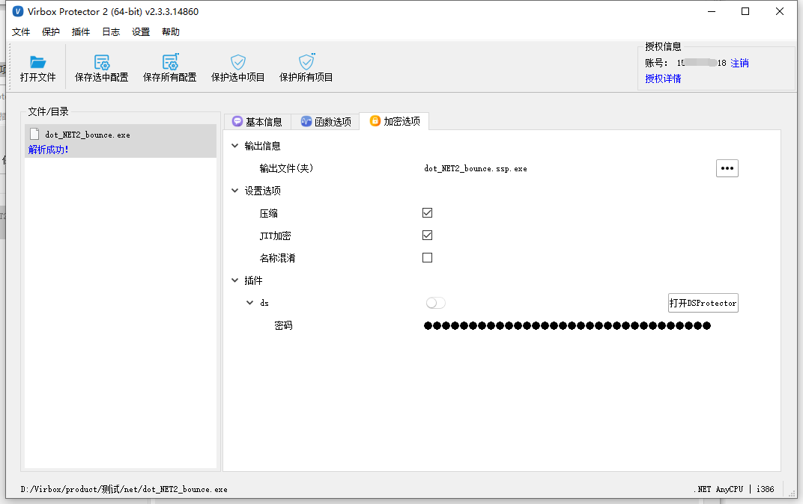
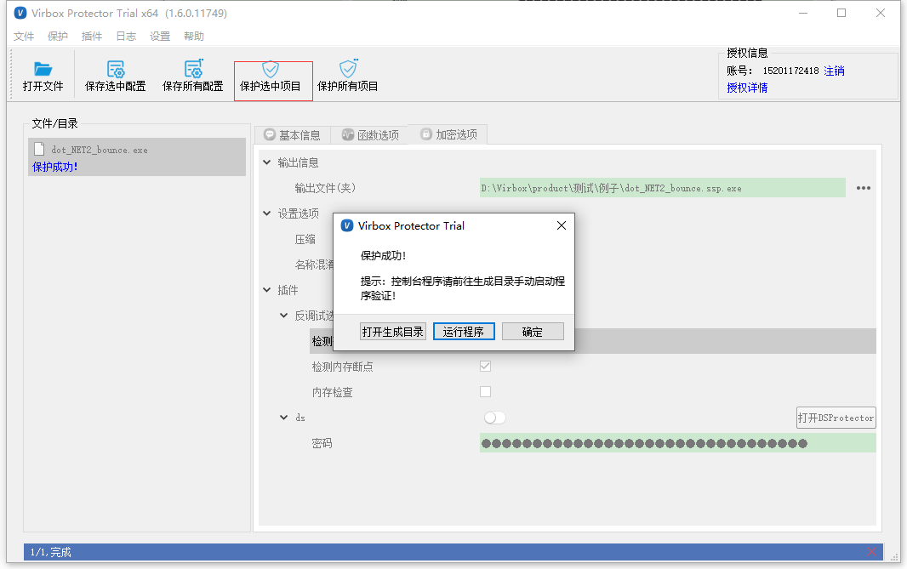
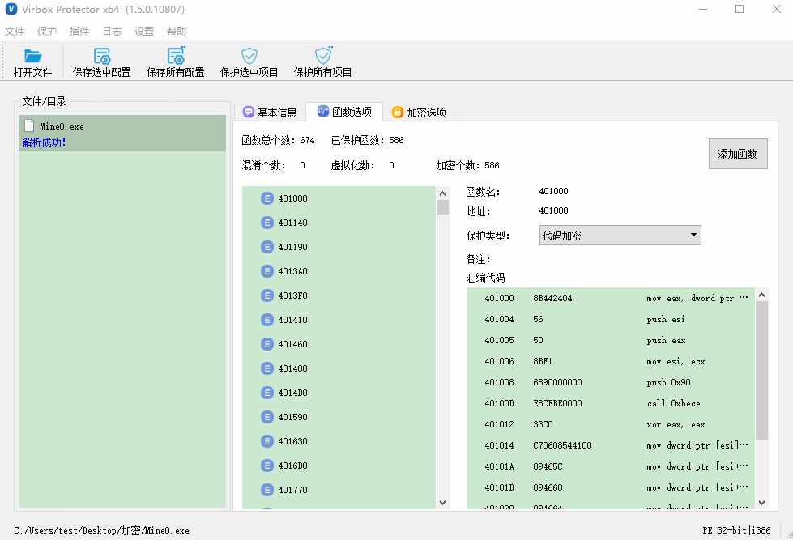

# NET程序保护流程

## 简介

.NET程序保护可支持.NET及.NET Core3.0以上的程序，支持dll及exe程序的直接加密保护。

------

## 操作流程

- 将需要保护的可执行文件或库文件导入Virbox Protector中
- 配置函数选项，设计个性化的保护方案
- 配置加密选项
- 执行保护
- 备份原始文件，将受保护的文件更名后替换原文件，保存好配置文件

------

**操作系统：Windows 10 家庭中文版**

**演示程序：dot_NET2_bounce.exe**

### 1.导入文件

将需要保护的可执行文件或库文件导入Virbox Protector中

### 2.配置函数选项

点击【函数选项】-【添加函数】，会列出所有函数选项。

函数的保护方式强度对比：代码加密>代码混淆

在选择函数的时候，可以CTRL+A 全选，然后鼠标右键，选择【代码加密】，选择后，点击确定。

### 3.配置加密选项

可设置压缩、JIT加密、名称混淆、反调试插件。

### 4.执行保护

点击【保护选中项目】，保护成功

如果提示【设置了其不支持的保护方式的函数】，再进入函数选项，将不支持的函数改成【代码混淆】或者不保护。

### 5.替换文件

**温馨提示：**加壳后的程序会在同一目录下生成两个新文件：**dot_NET2_bounce.exe****.ssp**和**dot_NET2_bounce****.ssp.exe**

**dot_NET2_bounce****.ssp.exe**为保护后的程序，请备份好未经保护的**dot_NET2_bounce**.exe，并将**dot_NET2_bounce****.ssp.exe**名称修改为**dot_NET2_bounce**.exe

**dot_NET2_bounce****.exe.ssp**为配置文件，保存了加密过程中的所有配置项目**。**