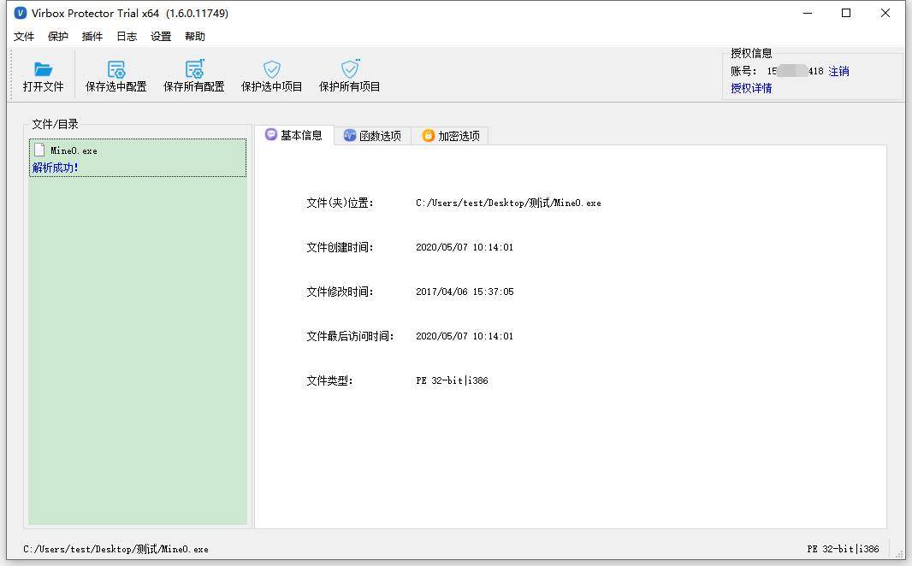
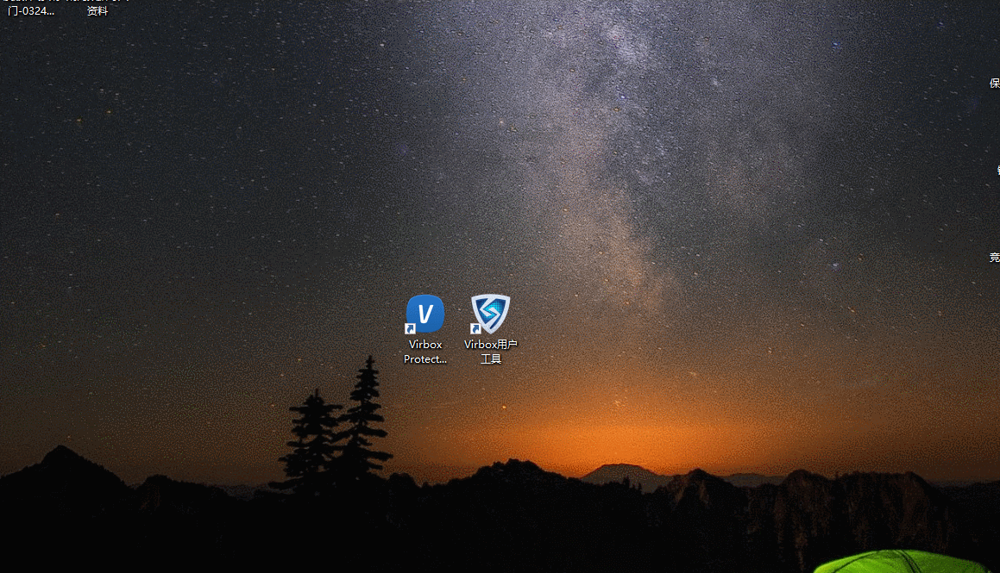
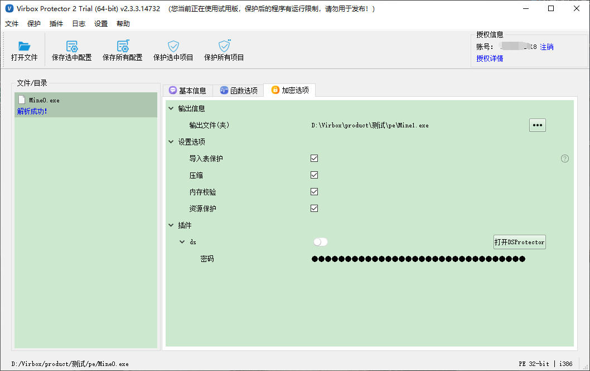
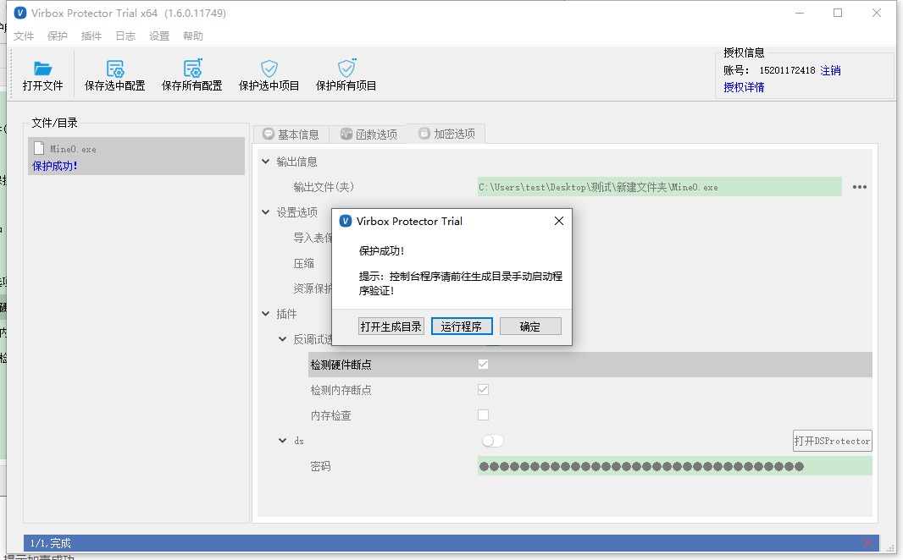

# 本地程序保护流程

## 方案说明

本流程适用于C、C++等开发语言开发的exe、dll 等 PE类程序加密。

## 操作流程

- 将需要保护的可执行文件或库文件导入Virbox Protector中
- 配置函数选项，设计个性化的保护方案
- 配置加密选项
- 执行保护
- 备份原始文件，将受保护的文件更名后替换原文件，保存好配置文件

### 1.导入文件

直接拖入文件或者选择打开文件的形式，选择需要加密exe可执行程序或者dll动态链接库。

:::tip 特别提醒

如果被加壳程序的相同目录下存在 xxx.map 文件，那么会自动加载 map 文件，将函数名称显示在界面当中，目前支持VS、VC、BCD、Delphi编译器生成的map文件

:::

### 2.配置函数选项

在函数选项，点击【添加函数】，鼠标左键选择需要保护的函数，鼠标右键设定保护方式。

- 针对C、C++、Delphi XE7及以上、PB、BCB等开发的PE程序及动态库，保护方式的安全性：代码虚拟化>代码混淆>代码加密。
- 针对C# 开发的程序，函数保护方式的安全性：代码加密>代码混淆。

### 3.加密选项配置

我们为高级用户，提供了加密选项的功能。PE 和.Net 程序，由于技术不同，所以在加密选项上，略有差异，您可以根据自己的需求，调整加密的具体方式。

- 输出文件：可以修改程序保护后生成文件的路径和名称。

  【特别提醒： 1 、如果只有文件名称，那么路径为源程序的路径； 2 、如果输出文件名和源文件同名，生成的程序会将源程序覆盖，非常不建议。】

- 导入表保护：这个选项能够对 PE 文件中的导入表进行了加密处理，隐藏了 API 列表。基于安全强度的考虑，我们建议用户使用这个选项。

  【特别提醒：导入表保护目前只适用于PE文件。】

- 内存校验：运行时对程序内存进行完整性校验，并提供 SDK 标签的方式，可对内存进行动态校验，防止程序被篡改。。

- 压缩：对加壳后的后的程序进行压缩处理，减小体积，同时可以防止静态反编译。

  【特别提醒： 1 、由于压缩模块需要一个固定大小的空间，如果被加壳的程序非常小压缩的效果并不明显还有可能出现体积更大的情况，对于体积较大的程序效果明显。 2 、不支持 DotNet动态库的压缩。 3 、不支持 arx 类型程序的压缩。】

- 资源保护：加密资源段，对被保护程序的资源区段进行加密，运行的时候需要用户使用相应许可进行解密方可使用程序。

  【特别说明：资源保护目前只能支持本地程序。】

- ds插件：DS Protector是数据保护工具，可以对程序的数据资源文件进行加密保护。

### 4.执行保护

所有选项配置完成，点击【保护选中项目】的按钮，完成加壳。提示保护成功。

### 5.替换文件

**温馨提示：**加壳后的程序会在同一目录下生成两个新文件：**Mine.exe.ssp和Mine.ssp.exe**

**Mine.ssp.exe**为保护后的程序，请备份好未经保护的**Mine**.exe，并将**Mine****.ssp.exe**名称修改为**Mine.exe**。

**Mine.exe.ssp**为配置文件，保存了加密过程中的所有配置项目**。**

