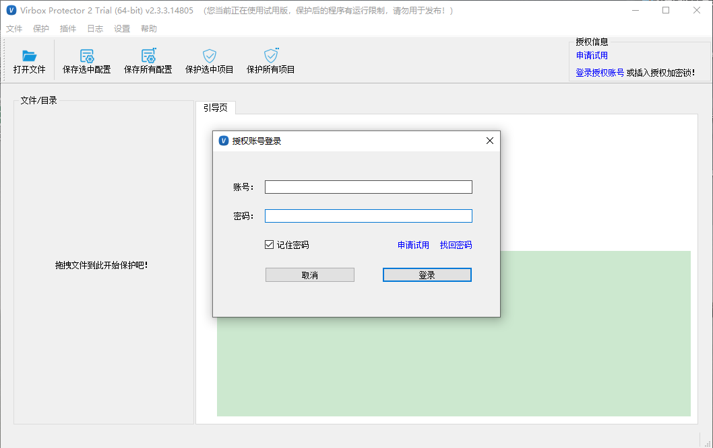
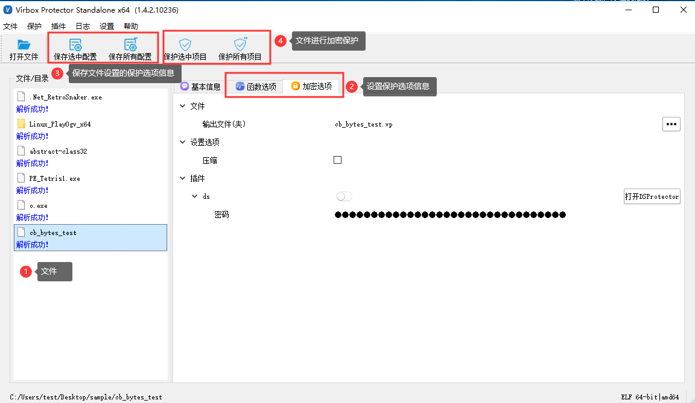
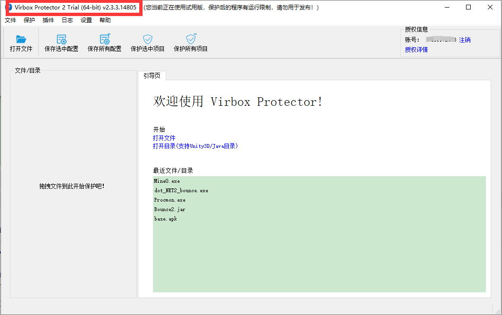
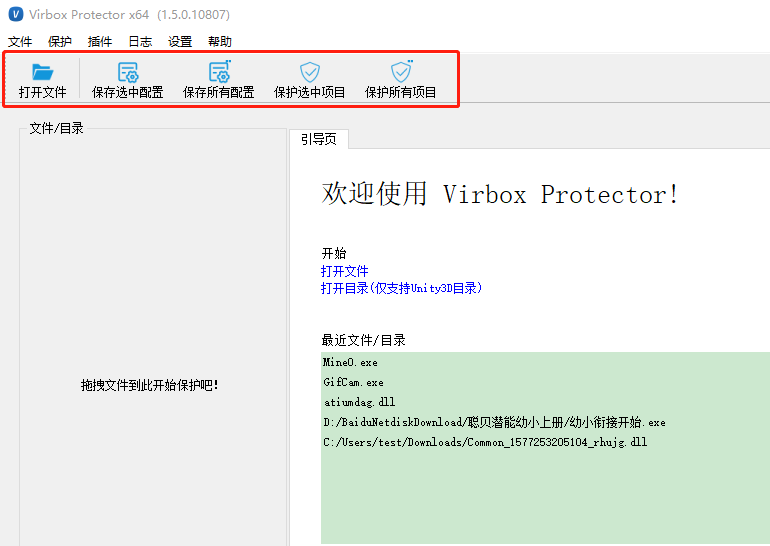
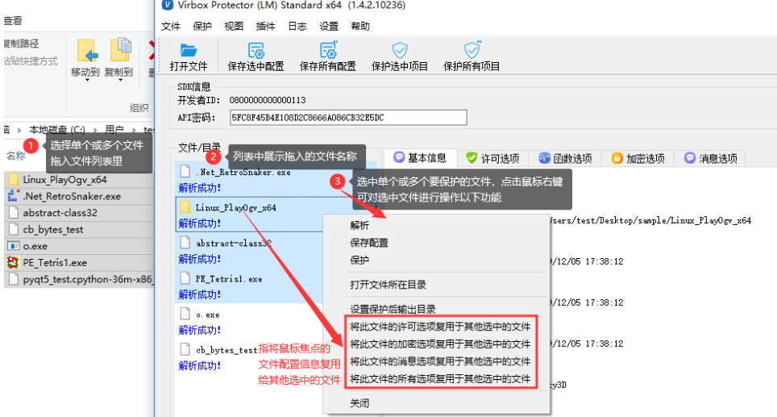
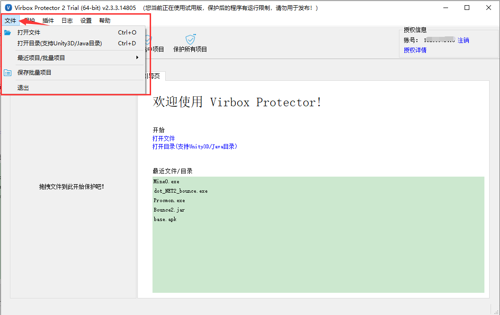
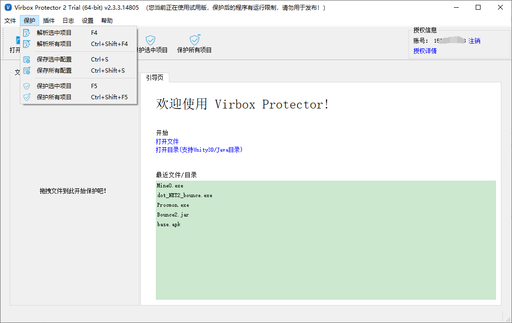

# 工具界面

**Virbox Protector 2 Trial** 版本的菜单和快速启动栏，以人性化、易于理解的优点，展示了如何快速为应用程序加密，保存配置文件等，下面，我们将详细的介绍每一个功能选项 。

------

## 主界面

首次打开 **Virbox Protector 2 Trial** ，展现在您面前的，就是登录界面。

登录之后，展现的是主界面。

温馨提示

如果此时您还没有试用账号，请点击申请试用按钮进行注册，或者直接访问 [https://shell.virbox.com/trail.html](https://aiot.virbox.com/trail.html) 注册试用

第一次登录时，建议点击【找回密码】进行修改密码。或者直接访问**修改密码链接：https://auth.lm.virbox.com/forgot.jsp**

登录后，即可进入 Virbox Protector 2 主界面。**Virbox Protector 2** 的主界面由6个部分构成：

-  **标题栏：**提供产品名称和版本号
-  **菜单栏：**提供文件、保护、插件、日志、设置、帮助等菜单选项
- **工具栏：**提供打开文件、保护选中配置、保护所有配置、保护选中项目、保护所有项目按钮，可以通过此栏目中的按钮，快速执行操作；
- **文件/目录：**提供被保护的文件展示区；
- **引导页：**欢迎页面，导入文件后，引导页会变成文件配置页；
- **状态栏：显示**基本状态信息；

------

## 标题栏

**Virbox Protector 2 Trial** 窗口最顶部的一栏被称为标题栏，主要用于显示 **Virbox Protector 2 Trial** 的产品名称和版本号。

## 工具栏

工具栏处显示打开文件、保存选中配置等快捷按钮，在工具栏处右键点击还可以隐藏工具栏。

- 保存选中配置：指保存选中文件的设置的函数选项、加密选项等配置信息。
- 保存所有配置：指保存文件列表中所有文件的设置的函数选项、加密选项等配置信息。
- 保护选中项目：指将选中文件进行加密保护。
- 保护所有项目：指将文件列表中所有文件进行加密保护。

 

## 文件目录列表

展示被保护文件的信息列表。

- 将文件拖入到 Virbox Protector 工具界面，工具界面展示文件信息。

- 鼠标焦点的文件右侧会显示程序的基本信息、函数选项、加密选项等信息，手动进行填写所需信息。

- 选中单个或多个文件，点击鼠标右键，在弹框列表中可对选中的文件进行批量解析、保存配置和保护等功能。

  - 打开文件所在目录：指打开鼠标焦点的文件所在目录。
  - 设置保护后输出目录：指将选中文件保护后输出的路径更改到指定的目录。

  

## **菜单栏**

### **文件**

**【打开文件】**：点击 打开文件 按钮，可以选择将 APK、SO、Mach-O 等文件导入，导入后的文件会显示在「文件/目录区」中，同时，可以将「批量项目」保存的文件直接打开。

**【打开目录「仅支持Unity3D/Java目录」】**：打开文件是导入单一文件，打开目录可以将指定目录下所有文件导入，目前支持 Unity3D / Java 应用。

**【最近项目/批量项目】**：您可以快速重新打开最近的单一保护项目，或批量处理的保护项目。最多支持5个最近的项目。

**【保存批量项目】**：如单次需要保护多个文件，保存批量项目会记录每个文件的绝对路径，但不会保存单一文件的配置信息，如果您希望保存配置，请使用工具栏中「保存选中配置」和「保存所有配置」菜单，批量项目会存储为xxx.vbpsln文件「xxx为自定义文件名」，需要使用时可通过「打开文件」直接打开。

**【退出】**：关闭 Virbox Protector 2  界面，退出整个应用

### 保护

「保护」菜单是 **Virbox Protector 2 Trial** 核心功能菜单。

**【解析选中项目】**：分析导入的文件，识别基本信息，成功解析后方可进行保护操作。

**【解析所有项目】**：分析所有导入的文件，识别基本信息，成功解析后方可进行保护操作。

**【保存选中配置】**：对选中文件设置函数选项、加密选项等信息，保存此信息以便下次直接使用，功能等同于工具栏中「保存选中配置」菜单。

**【保存所有配置】**：对选中的多个文件设置函数选项、加密选项等信息，保存所有文件信息以便下次直接使用，功能等同于工具栏中「保存所有配置」菜单。

**【保护选中项目】**：将选中文件进行加密保护，功能等同于工具栏中「保护选中项目」菜单。

**【保护所有项目】**：将文件列表中所有文件进行加密保护，功能等同于工具栏中「保护所有项目」菜单。

- - 