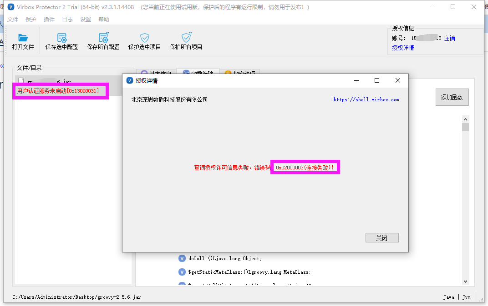
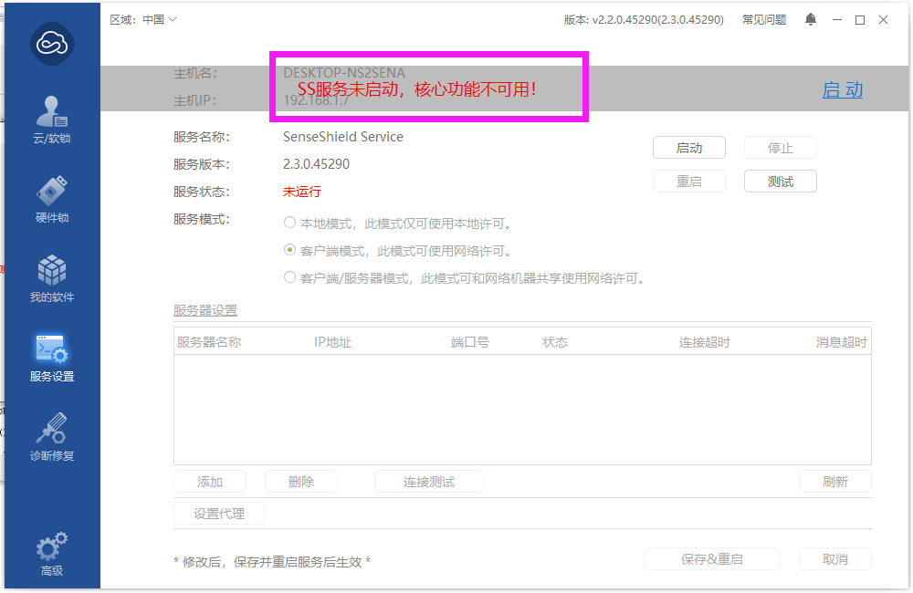

# Virbox Protector 连接失败

## 报错截图

## 原因：

Virbox 用户工具服务未启动

## 解决办法

### 1.打开Virbox 用户工具

在开始菜单搜索 Virbox用户工具，打开Virbox用户工具，显示 ss服务未启动

### 2.启动 SS服务

在Virbox 用户工具点击启动，启动正常后，即可正常使用 Virbox Protector。

如果点击启动，仍未正常，联系客服查看具体原因。

