# 主流安全软件免杀指南

## 问题描述

使用加壳工具对软件进行加壳，加壳后的程序杀毒软件会被误认为是病毒软件。引起此问题的原因主要是因为，加壳后程序，杀毒软件分析不出特征项，所以会导致误杀。

## 方案描述

对加壳后的程序，进行签名，经过签名的程序往往不容易被拦截，这个是基础。
针对杀毒软件误杀情形，我们提供3种解决方案：

1. 在安全厂商的开放平台上提交软件，接受安全检查；
2. 对被拦截或误报的文件，单独提交误报；
3. 最终用户在杀毒软件中设置白名单；

## 测试用例

本文档中的范例，以如下版本测试所得，所有软件病毒库均更新至2020年5月30日，但部分软件更新时间未知。

| 安全厂商 | 安全软件名称                                | 版本号                  | 更新时间   |
| -------- | ------------------------------------------- | ----------------------- | ---------- |
| 360      | 360安全卫士                                 | 12.0.0.2002             | 2019-06-20 |
| 360      | 360杀毒                                     | 5.0.0.8170              | 2020-05-18 |
| 金山网络 | 金山毒霸                                    | 11.2020.2.1.052100.1509 | 2020-05-21 |
| 腾讯     | 腾讯电脑管家                                | 13.5.20525.234          | 2020-02-20 |
| 卡巴斯基 | 卡巴斯基全方位安全软件（试用版）            | kts20.0.14.1085         | 未知       |
| 赛门铁克 | Norton 360 Premium                          | 22.20.2.57              | 未知       |
| 趋势科技 | Trend Micro Maximum Security 2020（试用版） | 16.0.1277               | 未知       |
| 小红伞   | Avira Free Antivirus                        | 15.0.2005.1889          | 未知       |
| 百度     | 百度杀毒                                    | 5.4.0.8                 | 未知       |

## 解决方案

### 360

### 开放平台

#### 1.1.1注册账号

注册并登录 360 软件开放平台：http://open.soft.360.cn/
360对资质审核比较严格，在过程中，需要提供公司营业执照副本、软件著作权证书副本和申请人本人持身份证的视频，另外还需填写申请表格，表格可以从注册的地方下载。

#### 1.1.2提交软件

在「我的软件」页面中选择提交我的软件

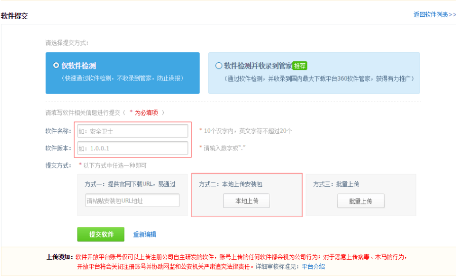

选择"仅安全检测"，并填写软件名称，软件版本（主要为了后续记录查看），提交方式可以选择本地上传安装包，然后提交软件。 可以在"软件列表"中查看已经提交过的待检测软件和"通过检测"的软件。目前软件提交后通过检测的时间大约为1天。

#### 1.1.3查询结果

提交完成后，一般一个工作日内能得到结果，可以到"我的软件"页面查询结果：

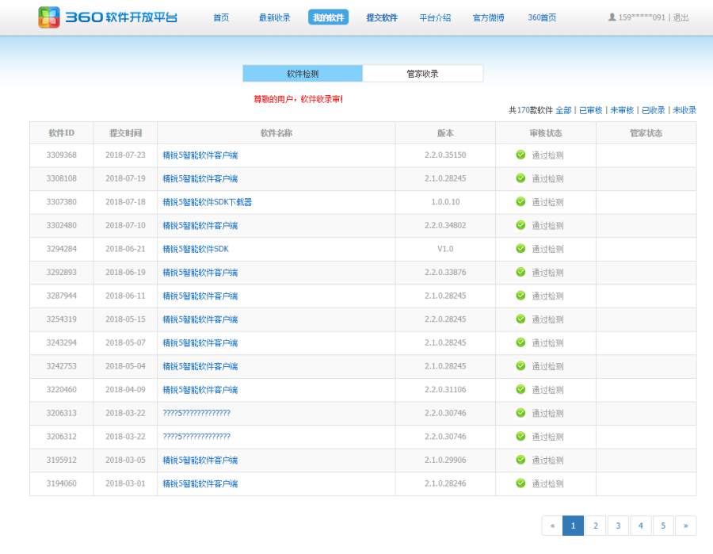

#### 提交误报

对于审核不通过，或者无法注册开放平台的用户，可以使用提交误报的方式进行免杀。
打开360软件开放平台首页: http://open.soft.360.cn/; 找到"软件误报反馈"链接。

进入页面填写相关内容后，直接提交即可，360会在1-2个工作日把结果以邮件的形式回复。

#### 白名单

对于审核不通过、无法注册开放平台提交误报不成功的开发者，可以让最终用户在自己的电脑上提交白名单。

**360安全卫士**

打开360安全卫士主界面，点击上方「木马查杀」菜单

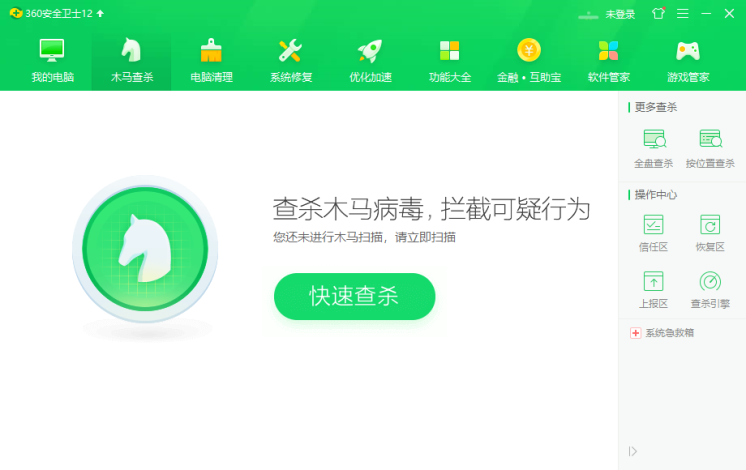

在「木马查杀」页面，点击右侧操作中心中「信任区」

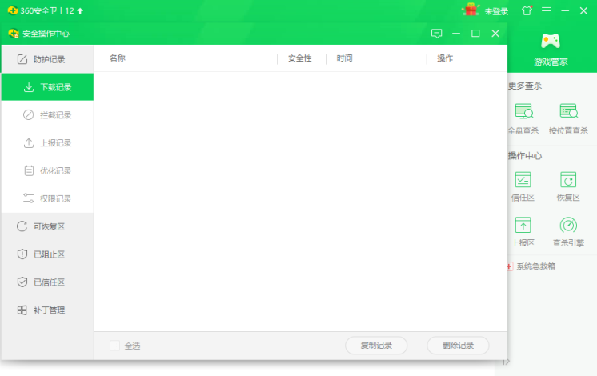

在「已信任区」页面添加白名单

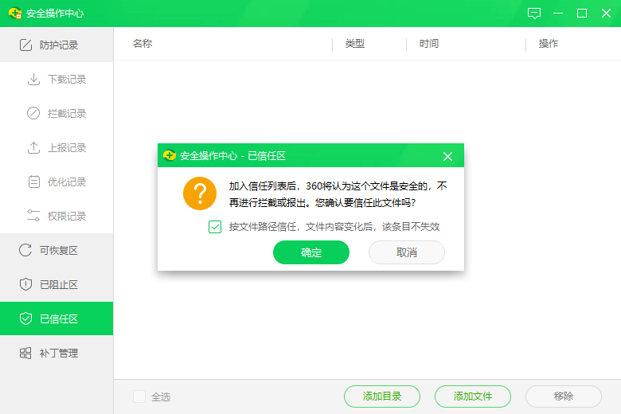

建议勾选「按文件路径信任，文件内容变化后，该条目不失效」，这是个非常有用的功能，如果开发者的软件安装目录不变，只需要加入白名单一次，以后更新不需要每次都提交白名单。

**360杀毒**

打开360杀毒，点击右上角的「设置」

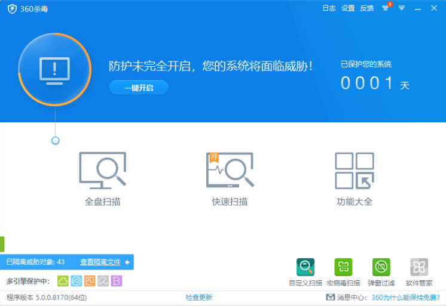

点击左侧「文件白名单」

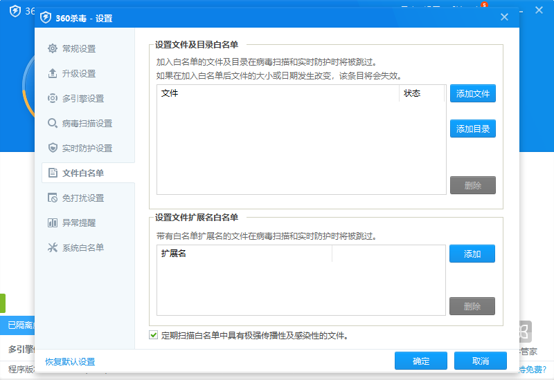

点击「添加文件」，将被误杀的程序添加白名单，点击确定即可

### 金山毒霸

#### 开放平台

#### 2.1.1注册账号

访问金山软件认证平台http://rz.ijinshan.com/，注册账号，提交相关资料进行资质审核。

#### 2.1.1提交软件

登录账号后，在"我的平台"页面，点击"上传PC软件"

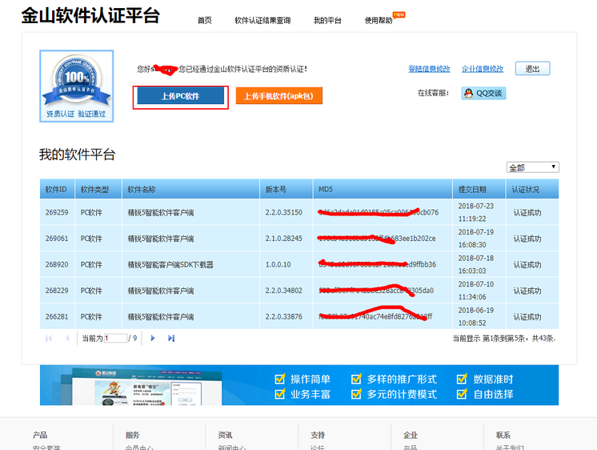

在"提交"页面填写相关内容，如果没有反馈，可以通过右上角的QQ联系客服

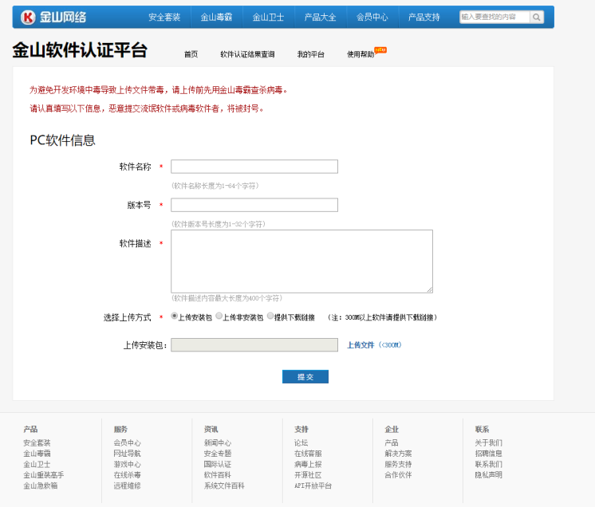

#### 提交误报

对于审核不通过，或者无法注册开放平台的用户，可以使用提交误报的方式进行免杀，通过QQ，联系在线客服，提交被拦截文件。

#### 白名单

打开金山毒霸主界面，点击右上角「设置」，选择「设置中心］

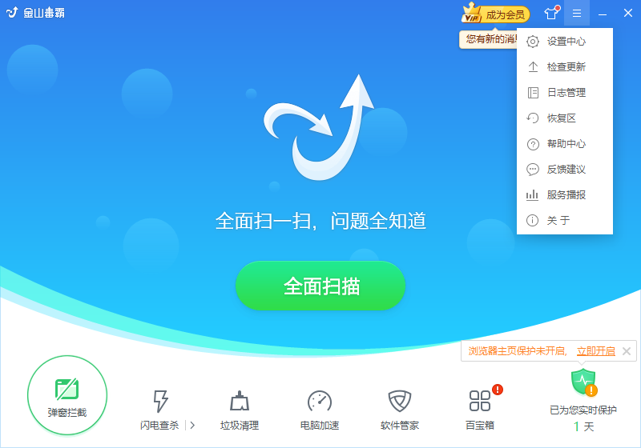

在「设置中心」页面的「安全防护」菜单下的「信任设置」里添加白名单

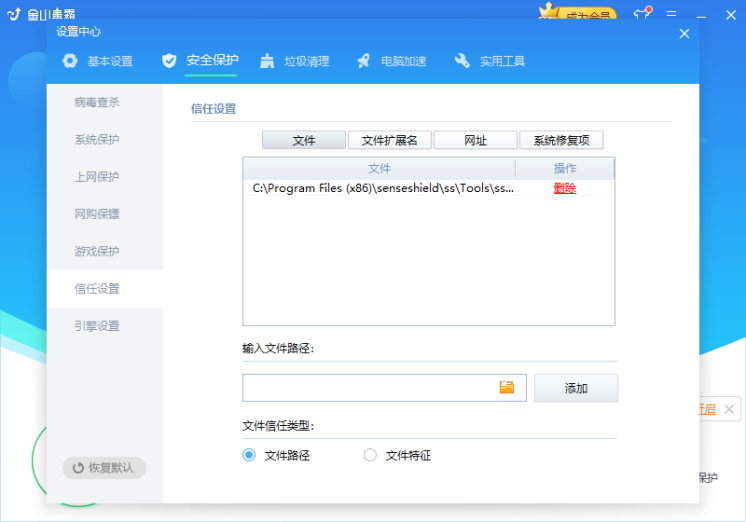

### 腾讯电脑管家

#### 开放平台

腾讯电脑管家目前不提供开放平台。

#### 提交误报

误报反馈是通过论坛发帖的形式，打开腾讯电脑管家论坛，找到"木马申诉举报"模块https://bbs.guanjia.qq.com/forum-280-1.html

新建主题，提交拦截截图，以及被拦截文件，文件超过16MB的，需要提供下载链接。

提交后，等待腾讯的处理结果。

#### 白名单

 打开腾讯电脑管家，点击左侧菜单栏中「病毒查杀」

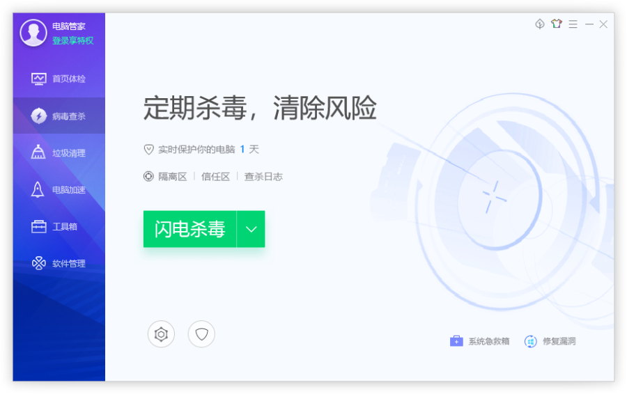

点击「信任区」

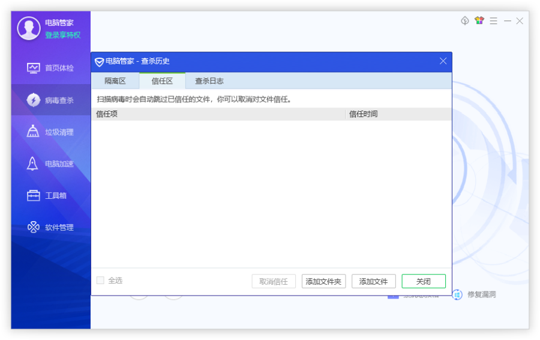

 在「信任区」添加自己需要的文件或文件夹。

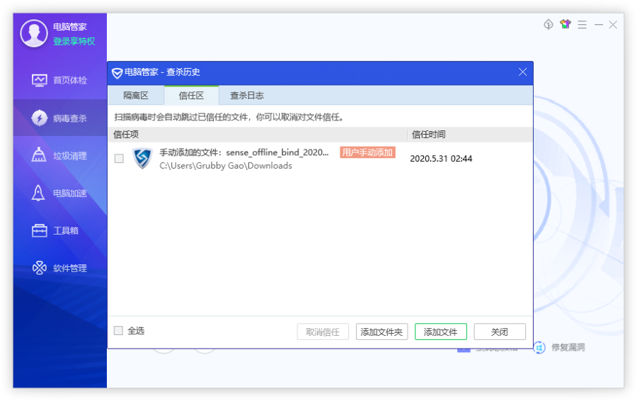

### 卡巴斯基

#### 开放平台

卡巴斯基目前不提供开放平台。

#### 提交误报

卡巴斯基不提供Web提交入口，需要将被误报的软件发送至[newvirus@kaspersky.com](mailto:newvirus@kaspersky.com)。

为避免被邮件服务器拦截，需要把被误报的文件采用压缩工具打包，设置密码为virus。

#### 白名单

打开卡巴斯基主界面，点击左下角的齿轮状的「设置」按钮

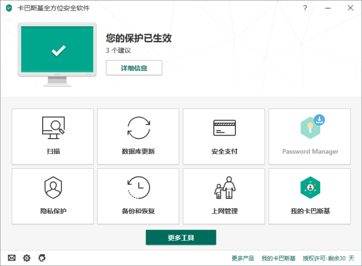

在「设置」界面点击"附加"，在右侧详情页面点击「威胁和排除项」

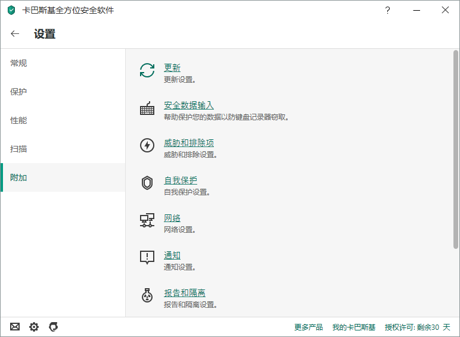

在新打开的页面点击「管理排除项」来添加白名单，或者「指受信任应用程序」来添加已运行的程序

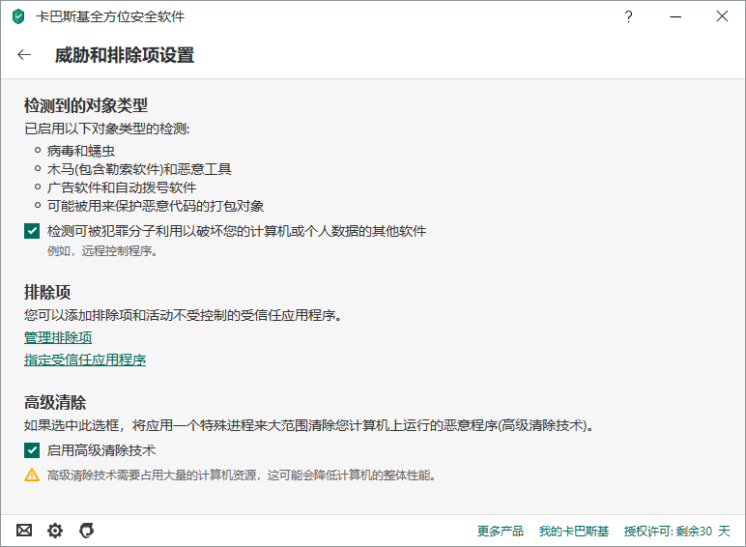

### Norton 360 Premium

#### 开放平台

赛门铁克目前不提供开放平台。

#### 提交误报

访问https://symsubmit.symantec.com/

选择Incorrectly Detected by Symantec

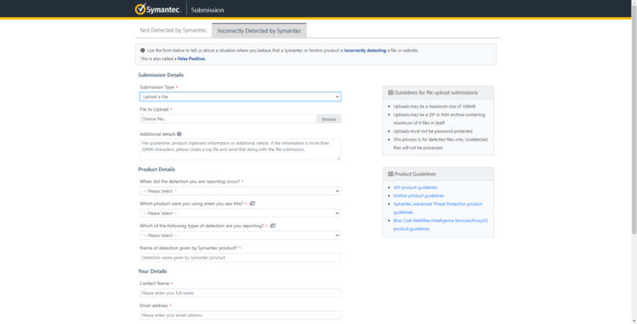

依次按照要求填写即可，目前该页面尚不支持中文，英文不熟练的开发者，建议使用浏览器的翻译工具

#### 白名单

打开诺顿主界面，点击右上角「设置」按钮

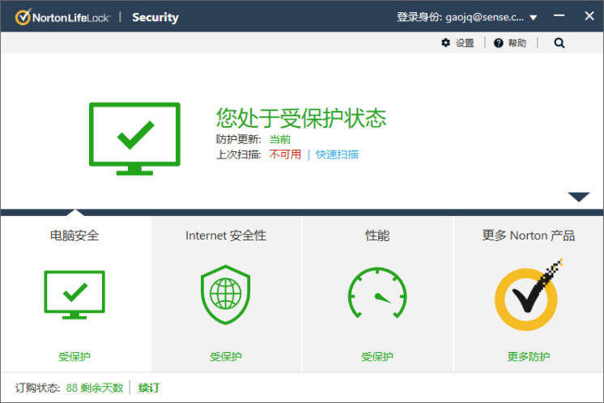

在「设置」页面，点击「防病毒」

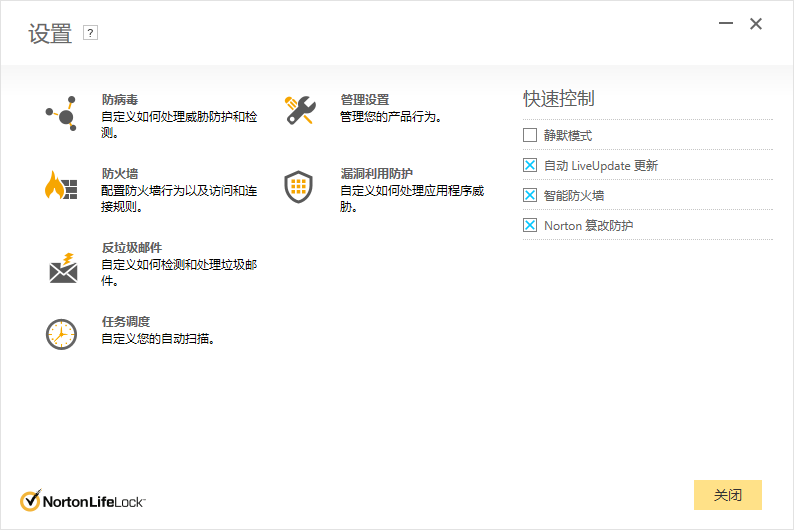

在「防病毒」页面，点击中间页签「扫描和风险」，然后在下面的明细页面往下拉找到「要从自动防护、脚本控制、SONAR和下载智能分析检测中排除的项目」，点击「配置」

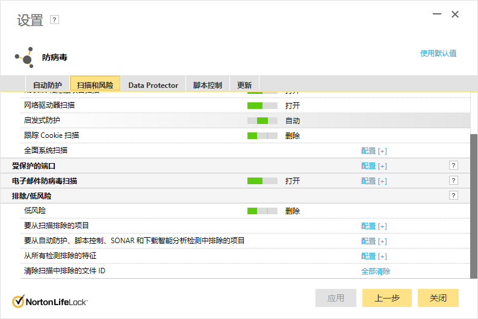

在打开的页面中添加白名单

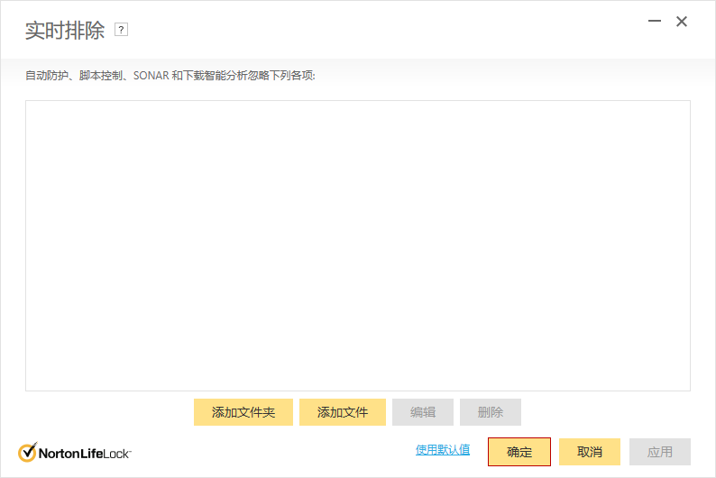

### Avira（小红伞）

#### 开放平台

Avira（小红伞）目前不提供开放平台。

#### 提交误报

访问https://www.avira.com/en/analysis/submit，提交误报信息

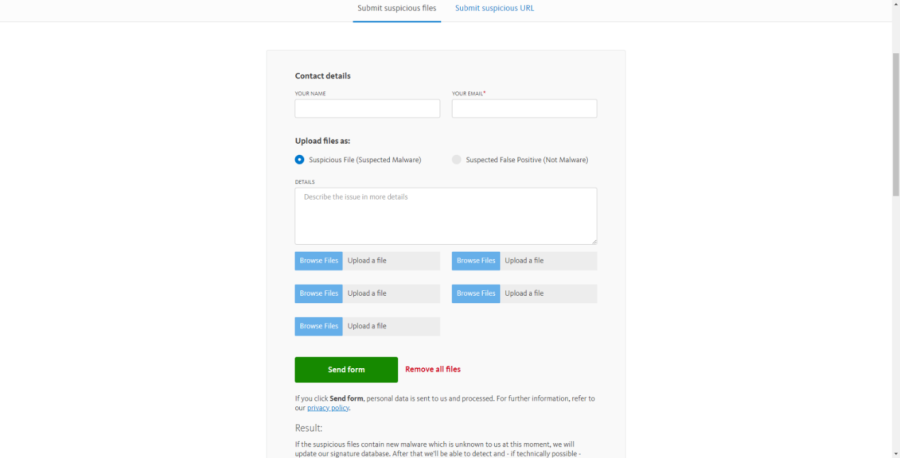

依次按照要求填写即可，目前该页面尚不支持中文，英文不熟练的开发者，建议使用浏览器的翻译工具

#### 白名单

打开小红伞主界面，在「此计算机」点击「打开」

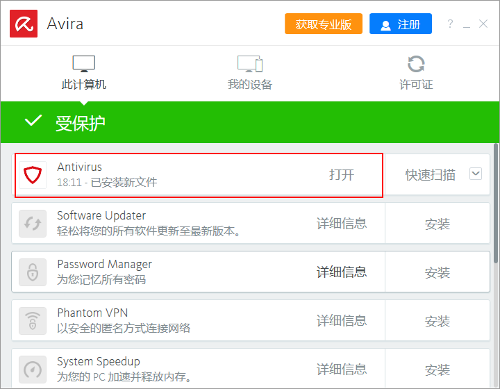

点击打开的页面左下角的「设置」按钮

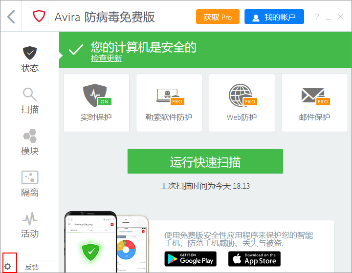

在「设置」页面点击「白名单」，在「白名单」详情页面设置白名单

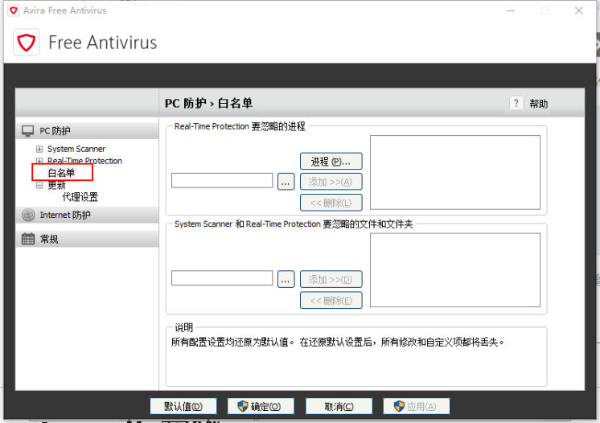