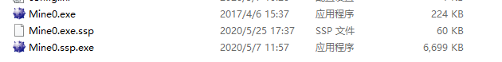
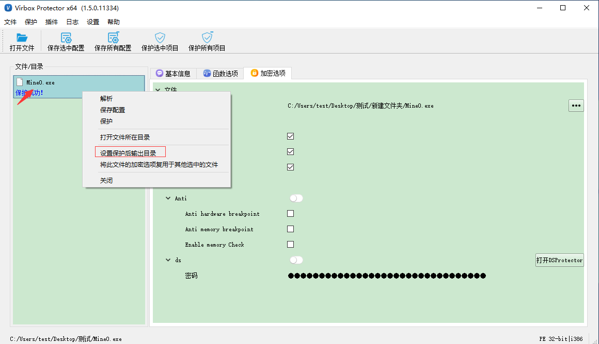

# 加密后的文件命名如何与源程序相同

## 问题描述

在使用Virbox Protector加密程序文件a.exe的时候，加密后的文件会自动命名为a.ssp.exe。如何生成文件名不带.ssp的加密文件呢？

- mine0.exe为原文件
- mine0.exe.ssp 为配置文件，发布软件时可删除；
- mine0.ssp.exe 为加密后的文件，需去掉.ssp改成原文件名称。

## 解决方法

在左侧文件列表，按鼠标右键，点击设置保护后输出目录，设置加密后文件存储的文件夹。加密后的程序文件即可输出到设置的文件夹，且不带.ssp。

