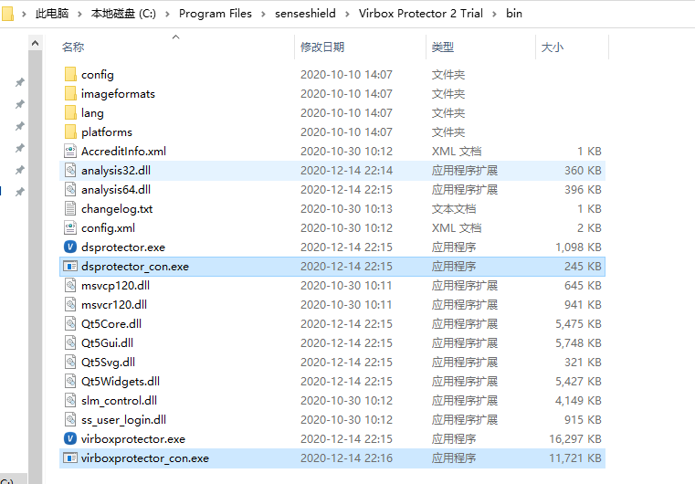
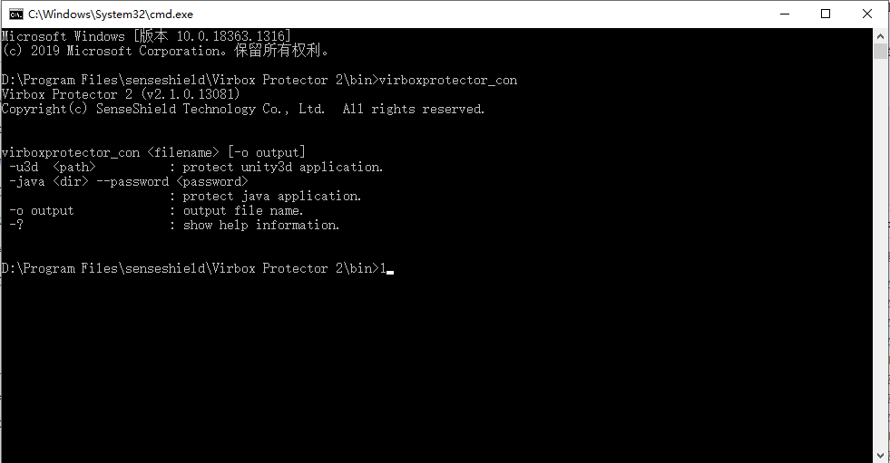
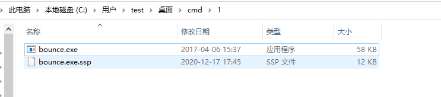

# 命令行操作文档

## VirboxProtector命令行使用文档

本文档适用VirboxProtector版本：2.1.0.13081。

## 1.开始使用命令行工具

**Windows系统：**

进入VirboxProtector安装目录，可以看到两个命令行工具

- virboxprotector_con.exe
- dsprotector_con.exe

**linux环境：**

Linux版默认安装路径：/usr/share/virboxprotector/,打开bin目录，即可找到virboxprotector_con及dsprotector_con。

### 启动命令行工具

打开命令行窗口，输入virboxprotector_com 启动命令行工具

## 2.保护可执行程序或者dll

### 2.1 使用VirboxProtector界面工具生成配置文件

可以在界面工具中可以对函数保护个数及保护类型进行选择，选择完毕后，点击保护选中配置，生成ssp配置文件，若不生成配置文件，则只会保护默认的入口函数。

如下图所示，设置函数选项及加密选项后，点击保存所有配置，即可生成ssp配置文件。

将ssp文件与待加密的软件放在同一个目录

### 2.2 输入命令对可执行程序加密

> 命令：
>
> Windows系统：VirboxProtector_con.exe的路径 需要被保护的程序路径 -o 输出文件的路径
>
> Linux系统：VirboxProtector_con的路径 需要被保护的程序路径 -o 输出文件的路径

Linux环境：

### **无ssp文件时命令行工具默认加密选项**

无ssp配置文件时，命令行加密以下程序时会添加的默认加密选项

- Net程序：默认加压缩和jit加密，即可保护所有函数，达到防止反编译的效果，如需对单个函数做代码加密或者混淆，可先配置ssp文件即可；
- ELF程序：默认添加压缩和内存校验；
- Macho程序：默认添加内存校验；
- PE程序：默认加压缩和内存校验；
- Android APK：默认添加反调试；

## 3.保护 Unity3D 程序

Unity3D 作为一个特殊的文件类型，和普通程序的保护方式不同，针对 Windows、Linux 和 macOS 平台的Unity3D，需要对 Unity3D 整个目录进行保护；针对 Android 平台的 Unity3D，需要对 Unity3D 的 apk 进行保护。

### 执行加密命令

> 命令：
>
> Windows环境：VirboxProtector_con.exe的路径 需要被保护的程序路径 -u3d -o 输出文件的路径
>
> Linux环境：VirboxProtector_con的路径 需要被保护的程序路径 -u3d -o 输出文件的路径

注意事项：

如需添加自定义程序集dll文件及添加其他资源文件，需要通过界面工具设置后，生成ssp文件。

## 4.保护Java程序

Java作为一个特殊的程序，和普通程序的保护方式不同，针对Windows、Linux和macOS平台的Java，需要对Java整个目录进行保护。

打开终端窗口，进入到“virboxprotector_con”所在的路径，直接输入“virboxprotector_con”运行可查看帮助信息；

> 命令：virboxprotector_con -java <需要被保护的程序目录> --password -o <输出文 件的目录>
>
> 示例：virboxprotector_con -java D:\Virbox\product\测试\测试\java程序 --password 33sdfasds -o D:\Virbox\product\测试\测试\ssp.java程序

加密成功后输出的文件：

## 5.保护python程序

加密python的py或pyc时，需先使用VirboxProtector对python.exe加密，再使用dsprotector.exe对py/pyc文件加密。使用命令行工具对python.exe加密参考保护可执行程序流程。

5.1.使用VirboxProtector界面工具对python.exe加密时，会生成python.exe.ssp配置文件

python.exe.ssp配置文件

5.2.启动dsprotector

命令参数解析

| 参数      | 功能                                 |
| :-------- | :----------------------------------- |
| filename  | 指对单个文件的保护                   |
| directory | 指对文件目录的保护                   |
| -c ssp    | 指Virbox Protector工具生成的配置文件 |
| -o output | 指保护后输出文件路径                 |

5.3.执行命令保护

5.3.1 单个资源保护

Windows命令行：dsprotector_con.exe [待保护的文件] -c [ssp文件] -o [保护后的文件]

Linux命令行：dsprotector_con [待保护的文件] -c [ssp文件] -o [保护后的文件]

- 待保护的文件：待加密的文件路径
- ssp文件：ssp文件路径
- 保护后文件目录：加密后的文件路径（可设置到一个新的目录或者改名）

命令行示例：dsprotector_con.exe C:\Users\test\Desktop\cmd\python\py.py -c C:\Users\test\Desktop\cmd\python\python.exe.ssp -o C:\Users\test\Desktop\cmd\python\保护后\py.py

5.3.2 保护整个目录

如有多个py或者pyc文件，可直接对整个目录保护。

命令行：

Windows系统：dsprotector_con.exe [待保护的文件目录] -c [ssp文件] -o [保护后文件目录]

Linux系统：dsprotector_con [待保护的文件目录] -c [ssp文件] -o [保护后文件目录]

- 待保护的文件目录：待加密的文件所在目录的路径
- ssp文件：ssp文件路径
- 保护后文件目录：加密后的文件存储的目录路径

命令行示例：dsprotector_con.exe C:\Users\test\Desktop\cmd\python\保护前 -c C:\Users\test\Desktop\cmd\python\python.exe.ssp -o C:\Users\test\Desktop\cmd\python\保护后

## 6.保护PHP程序

使用dsprotector_con对php文件加密，参考保护python程序

## 命令行错误码列表

| 错误码              | 详细信息                                                     |
| :------------------ | :----------------------------------------------------------- |
| Error（0x00000000） | success ，成功。                                             |
| Error（0x00000001） | 无效的参数。                                                 |
| Error（0x00000002） | 内存不足。                                                   |
| Error（0x00000003） | 配置文件错误。                                               |
| Error（0x00000011） | 文件已经加过密。                                             |
| Error（0x00000012） | 读取文件失败，filename文件或directory目录找不到              |
| Error（0x00000013） | 写入文件失败，指文件被占用或无权限写入。                     |
| Error（0x00000021） | 未发现ssp文件。                                              |
| Error（0x00000022） | 配置文件错误。                                               |
| Error（0x00000023） | ssp文件缺失ds插件配置，或手动将ssp文件中的ds节点给删除了。   |
| Error（0x00000024） | ssp文件ds插件未激活，是指DS按钮未打开。                      |
| Error（0x00000025） | ssp文件中缺少ds插件密码节点，没有输入密码或者配置文件中密码节点给删除了。 |
| Error（0x00000031） | 文件太小（<=4字节）。                                        |