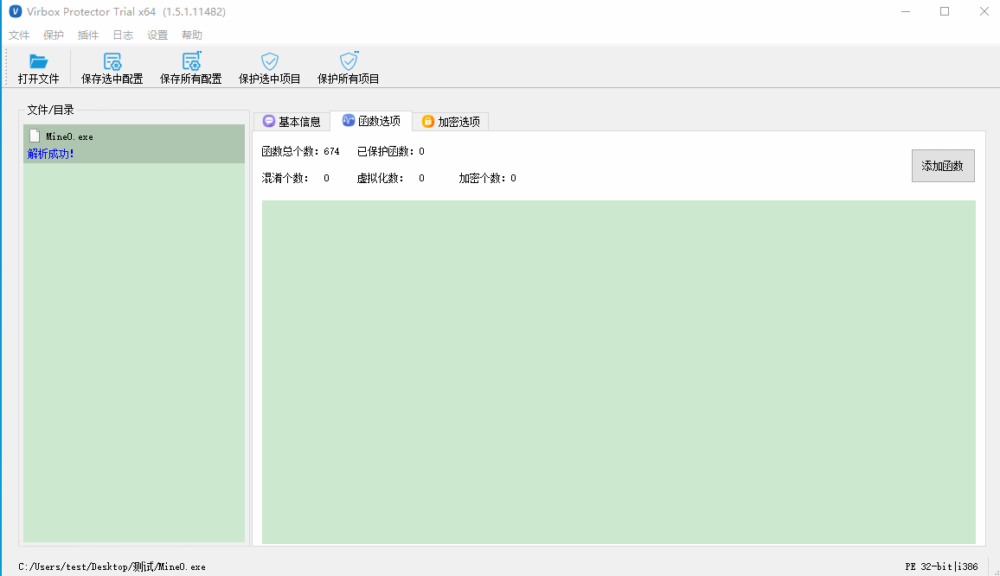
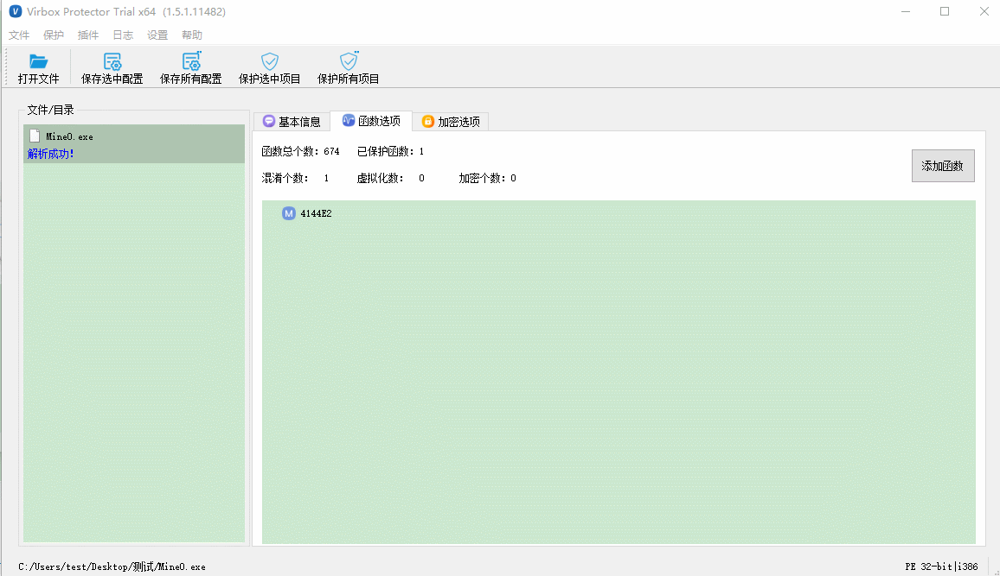
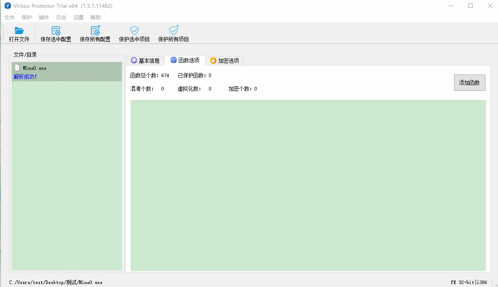

# 添加函数的常用操作

### 1.选择全部函数

快捷键：CTRL + A 即可选中所有函数，然后鼠标右键选择保护方式。

### 2.单选一个函数

鼠标左键选择函数，右键选择保护方式。

### 3.选中多个不连续的函数

按住CTRL键，鼠标左键选择要保护的函数，选择完毕后，在选中的函数上按鼠标右键选择保护方式。

### 4.选中连续的函数

方法1：选择开始函数，按住shift键，再选中末尾函数即可，右键选择保护方式。

方法2：按住鼠标左键不动往下拉即可，右键选择保护方式