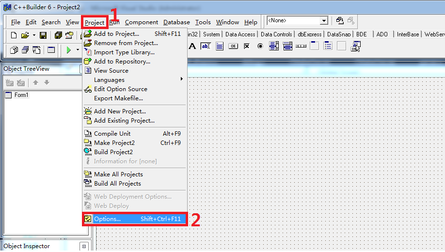
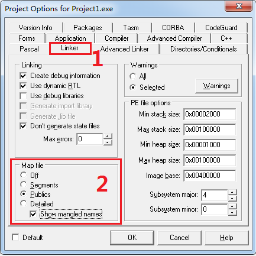
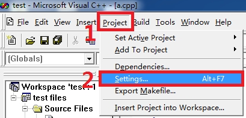
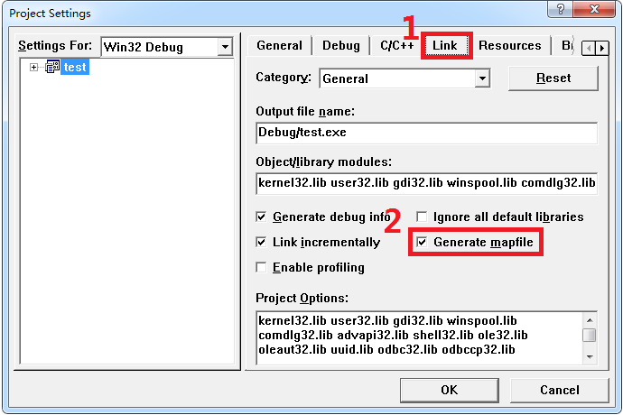
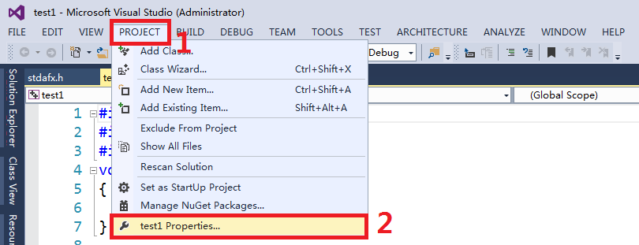
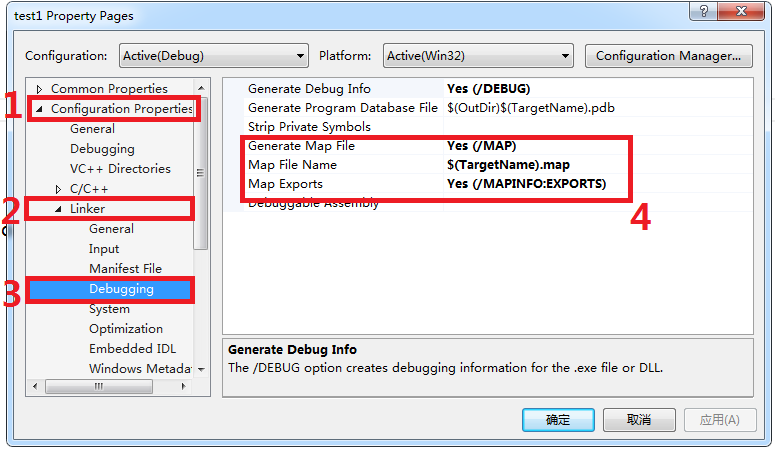
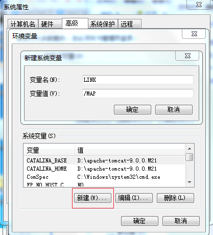
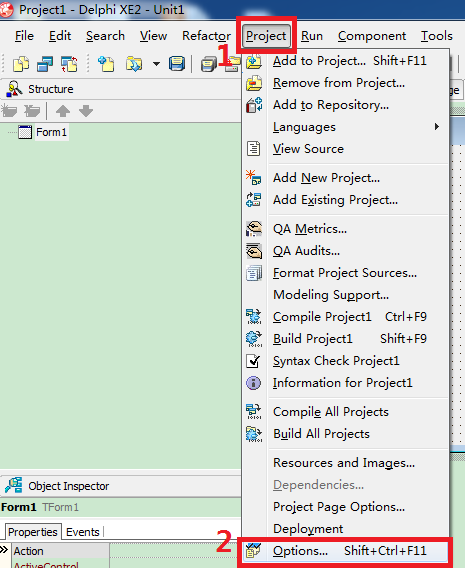
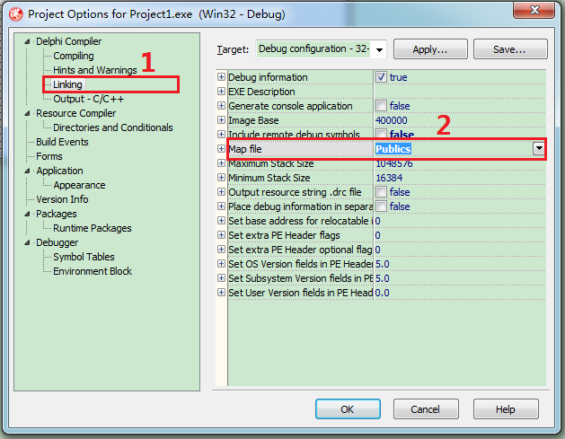

# 生成map文件

## 用 BCB 生成 map 文件

- 工程设置如下图：

## 使用VC生成map文件

- 工程设置如下图：

## 使用 VS 生成 map 文件

- 工程设置如下图：

  

  

  

## 使用 VB6.0 生成 map 文件

- 工程设置如下图：

## 使用 Delphi 生成 map 文件

- 工程设置如下图：

  

