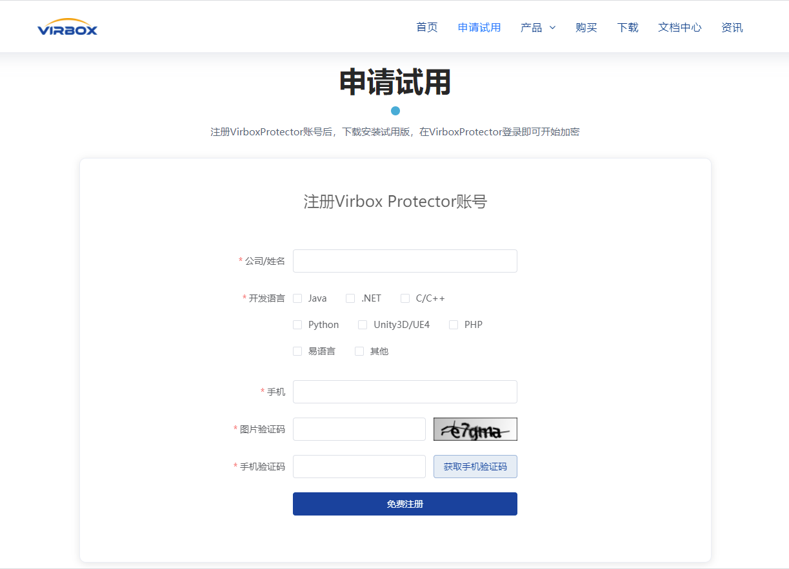
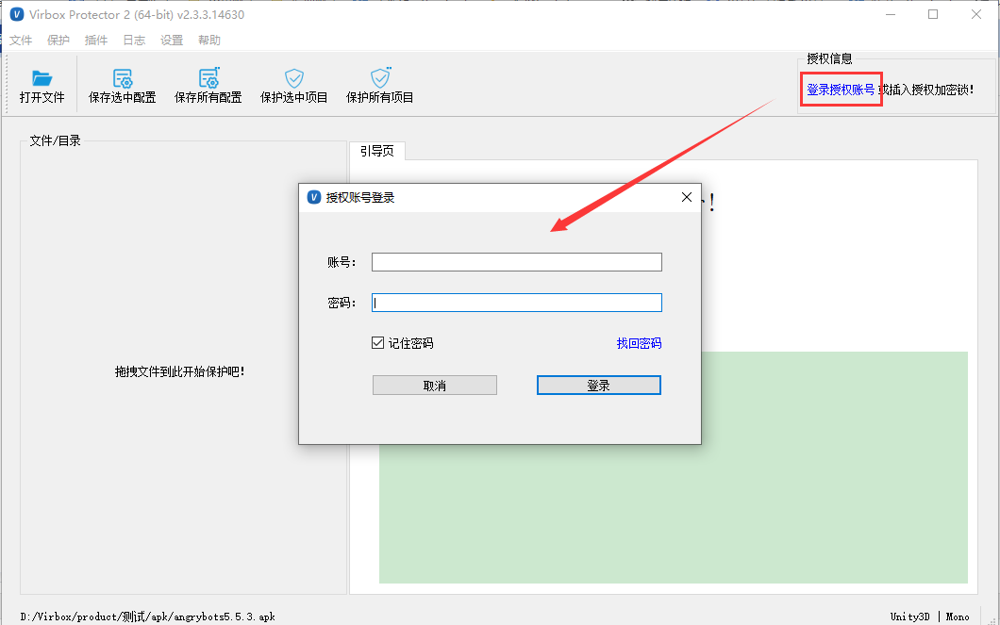
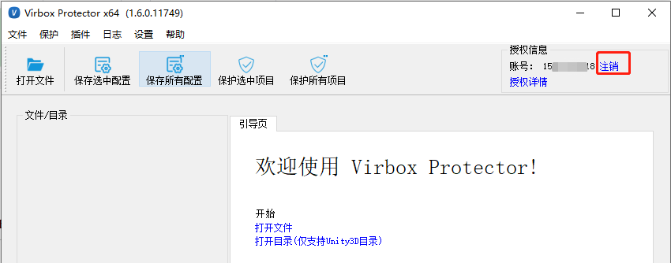

# 注册激活

Virbox Protector 提供了试用版和正式版，试用版与正式版功能一致，只是试用版加密的程序只能运行7天，不可用于正式发布。

您可以在 Virbox Protector 官网申请试用版的使用授权，每个用户可以获取30天的试用版使用授权。试用版可支持所有开发语言及系统，正式版需按开发语言及系统版本购买。

------

## 注册 Virbox Protector 账号

访问 **Virbox Protector 2** 的官方网站的申请试用页面：https://shell.virbox.com/apply.html 填写表单提交注册即可申请成功

成功注册后，您会收到一条包含登录密码的短信。建议在第一次登录 Virbox Protector 时进行修改密码，修改密码连接：**https://auth.lm.virbox.com/forgot.jsp**

**如果您注册时提示已经申请过，请联系我们商务人员手动延长时间。**

**如果注册后，收到的短信里没有密码，可能您已经注册过VirboxLM平台的账号，可使用VirboxLM账号的密码进行登录，或者通过修改密码方式来找回您的密码进行登录。**

##  登录 Virbox Protector

使用您的注册账户和收到的登录密码，登录使用。**Virbox Protector 2 Trial** 需要联网登录，如果您的设备无法连接网络，请联系我们，获取离线方案。

### **注销**

如果您需要更换电脑使用Virbox Protector，可点击【注销】，注销成功后，即可在另一台电脑登录使用。

