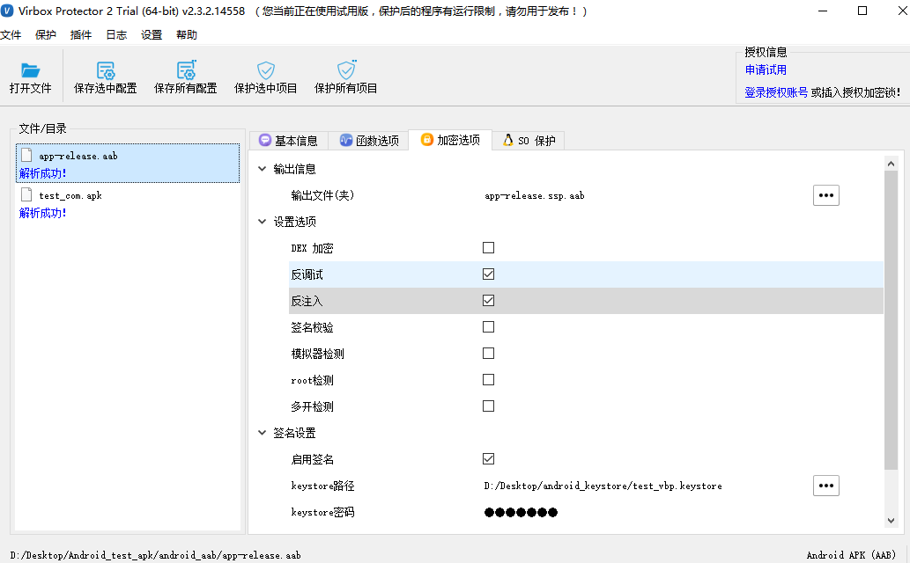
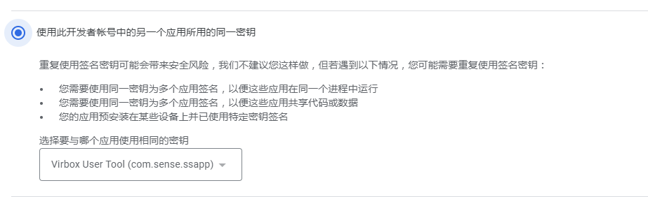

# Android aab 加密流程

反调试功能，可抵挡动态调试，可以避免通过IDA等逆向工具分析获取源码 ，签名校验功能，可以防止二次打包签名，可以对Android APK里关键代码、核心逻辑进行加密保护。

## 加密流程

### 1. 将Android apk/aab 添加到工具中

可通过以下两种方式将待加密的文件添加到 Virbox Protector。

1）直接拖入到 Virbox Protector

2）点击工具栏的【打开文件】，选择要加密的文件。



### 2. 在加密选项处进行设置

包括dex加密、反调试、反注入、签名校验、模拟器检测、root检测、多开检测功能。


**输出信息**

1、默认输出文件名为***.ssp.aab，存储在和原aab程序同级目录下。

2、也可以自行修改输出的文件名称，并另存到其他目录中。

**设置选项**

1、dex加密，对 DEX 文件整体加密并隐藏，防止反编译。

:::tip Google Play 上架建议

建议：在Google Play上架，建议不勾选dex加密，否则可能提示“账号关联”。
解决：建议选择虚拟化方式保护dex文件里的函数。

:::

2、反调试，多种系统相关的检测技术检测调试器，发现调试器后清场退出。

3、反注入，通过双进程 ptrace 守护技术，防止其它进程对 APK 进程附加调试或注入。

4、签名校验，校验开发者签名，防止二次打包。

:::tip **注意**

使用“签名校验”功能，必须勾选“启用签名”，才能保护成功。

:::

5、模拟器检测，可以防止程序在模拟器中运行。

6、root检测，可以防止程序在root过后的手机上运行。

7、多开检测，可以防止程序多开分身。

**签名设置**

1、直接选择keystore文件，输入keystore密码、密钥别名和密钥密码。


2、若无keystore文件，可以重新生成。

```
参考命令如下：
keytool -genkey -alias 别名 -keyalg RSA -validity 36500 -keystore 文件命名
```

3、勾选“启用签名”，文件保护后会自动签名。

若不勾选，文件保护后，需要重新签名。

```
aab签名参考命令如下：
jarsigner -digestalg SHA1 -sigalg SHA256withRSA -keystore keystore文件 -storepass "密码" -keypass "别名密码!" "准备签名的文件" "别名"
```

### 3. 函数选项

选择，添加函数-》选中函数-》右键-》选择虚拟化-》确定。

dex虚拟化是将 DEX 方法中的字节码转换为自定义的虚拟机指令，由自定义解释器解释执行，保护后无法被还原。

VBP界面会显示默认函数为虚拟化，一般入口类的函数会默认勾选，核心函数需要根据自己需求选择。


### 4.**so库选项**

对 SO 库中的代码段压缩加密，隐藏导入导出函数。

1、点击选择文件，选择自己需要保护的so库。

2、隐藏符号表可以隐藏导出符号，根据自己需求选择是否勾选。

:::tip **注意**

勾选“隐藏符号表”，so库需要全选，反之，so库若选择部分，“隐藏符号表”不建议勾选，否则运行可能会出问题。

:::


### 5. 保护

**保存配置**

1、以上配置选择完成后，点击“保存选中配置”保存当前文件的设置，当同时保存多个程序的设置时，点击“保存所有配置”选项。

2、保存成功后，在程序（如demo.aab）的同级目录下会生成一个ssp配置文件（如demo.aab.ssp）。

**保护文件**

保存配置成功后，点击“保护选中项目”，保护成功后就会在程序（如demo.aab）的目录下会生成保护后的程序（如demo.ssp.aab），当同时保护多个程序时，点击“保护所有项目”选项。

## GooglePlay商店上架

1、打开Play管理中心，选择相应应用，创建正式版本。

2、“应用签名偏好设置”处进行选择。


- 让Google管理并保护您的应用和签名密钥（推荐选项）：若选择此选项，则aab使用VBP加固时不要勾选“签名校验”，否则Google会重新二次签名导致aab应用运行崩溃
- 使用此开发者账号的另一个应用所用的同一密钥：

:::tip **注意**

1）若已经成功上架过应用程序，则可以进行选择，否则此选项将无法选择。
2）aab加固时若勾选“签名校验”选项，则选择的应用密钥也要和加固aab时所用的密钥文件一致，否则无法使用。

:::



- 从Java密钥库导出并上传密钥

:::tip **注意**

1）根据提示操作下载PEPK工具
2）输入命令：java -jar pepk.jar --keystore=D:\Desktop\android_keystore\test_vbp.keystore --alias=vbp.keystore --output=output.zip --include-cert --encryptionkey=eb10fe8f7c7c9df715022017b00c6471f8ba8170b13049a11e6c09ffe3056a104a3bbe4ac5a955f4ba4fe93fc8cef27558a3eb9d2a529a2092761fb833b656cd48b9de6a
3）上传生成的zip文件（--keystore指定的需要和aab加固时所选的keystore一致，才可以使用“签名校验”）

:::

- 导出并上传密钥（不使用Java密钥库）：若aab加固可以勾选“签名校验”选项，keystore文件和密钥需要保持一致。
- 选择退出Play App Signing计划：选择此选项，无法上传aab应用。

3、上传加固后的aab应用。

4、发布版本。

:::tip 注意

请勿使用试用版加固后的aab上架Google Play商店，请联系商务获取正式版。

:::