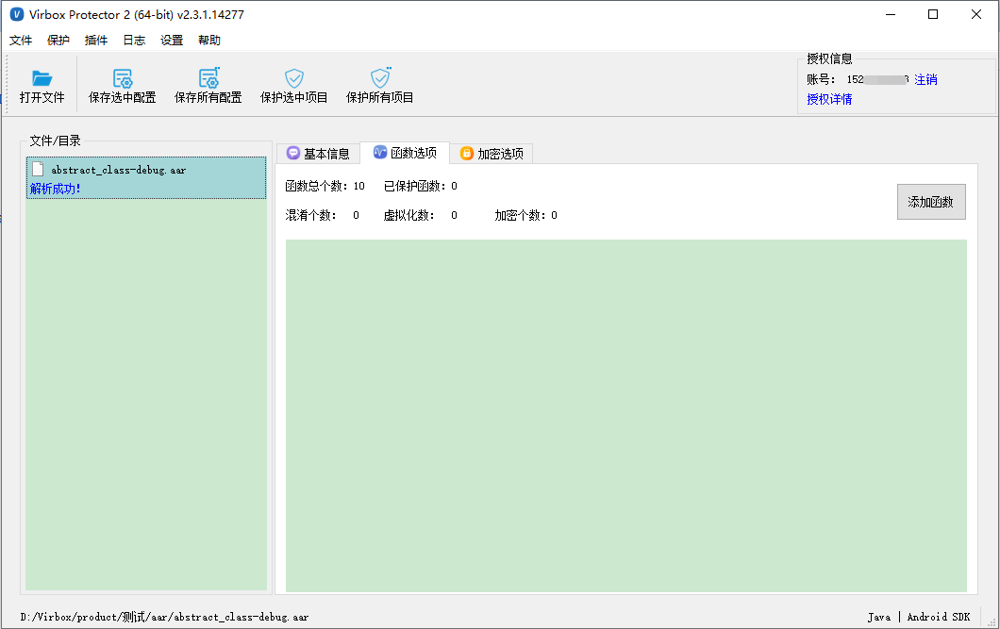
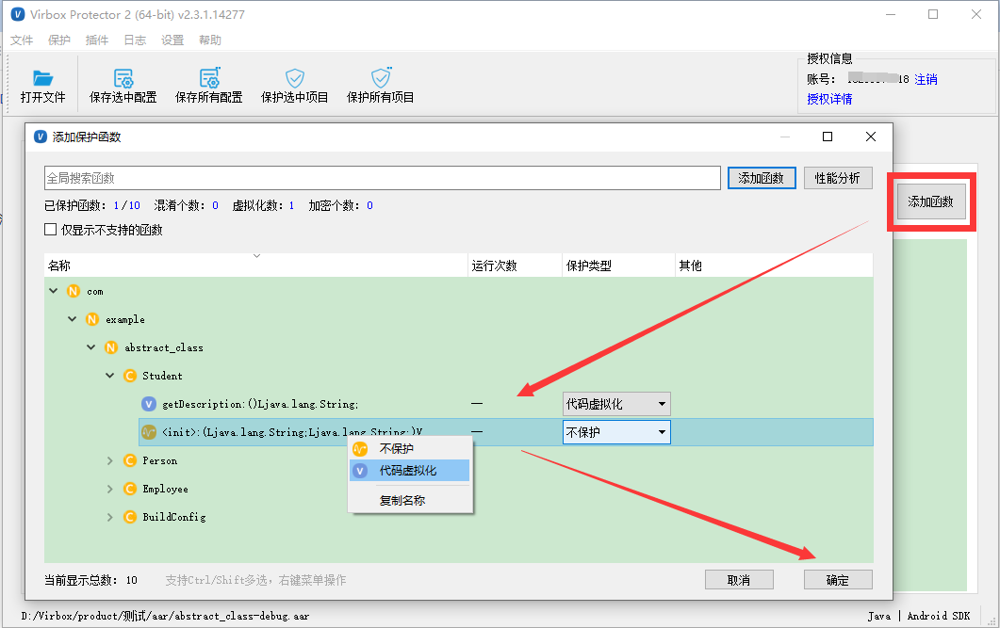
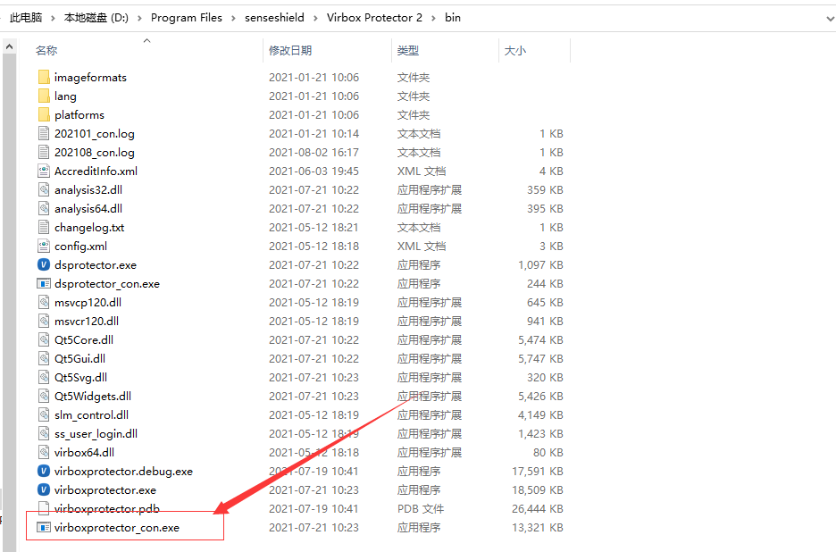

# Android aar 加固流程

## 方案简述

对 Android arr 文件中jar进行虚拟化等技术保护，保护后的代码无法被还原，防止逆向分析。

------

## 界面操作流程

### 1.导入文件

将 aar 文件拖入到 Virbox Protector 中



### 2.设置函数选项

函数选项，点击添加函数，对需要保护的函数选择虚拟化保护。



### 3.点击【保护选中项目】

设置完成后，点击【保护选中项目】，提示加密完成表示完成加密。加密完成后，会生成加密后的aar包。

abstract_class-debug.ssp.aar 是加密后的 aar 文件

abstract_class-debug.aar.ssp 是加密时的配置文件

## 命令行加密流程

------

本文以 test.aar 为例。

------

### 1.生成 ssp 配置文件

使用 Virbox Protector 界面工具,按照上面的流程，配置 函数选项，设置完成后，点击【保存所有配置】，即可生成 SSP 配置文件：test.aar.ssp 。将生成的 ssp 配置文件(test.aar.ssp)与待加密的文件(test.aar)放在同一个目录下。

### 2. 运行 virboxprotector_con

打开终端窗口，进入到“virboxprotector_con”所在的路径，直接输入“virboxprotector_con”运行可查看帮助信息；可在 Virbox Protector 快捷方式上，鼠标右键 选择 打开文件所在位置，即可进入到“virboxprotector_con”所在的路径



### 3. 执行命令加密 aar

命令：

```undefined
virboxprotector_con test.aar -o test.ssp.aar
生成的 test.ssp.aar 就是加密后的 aar 文件
```

