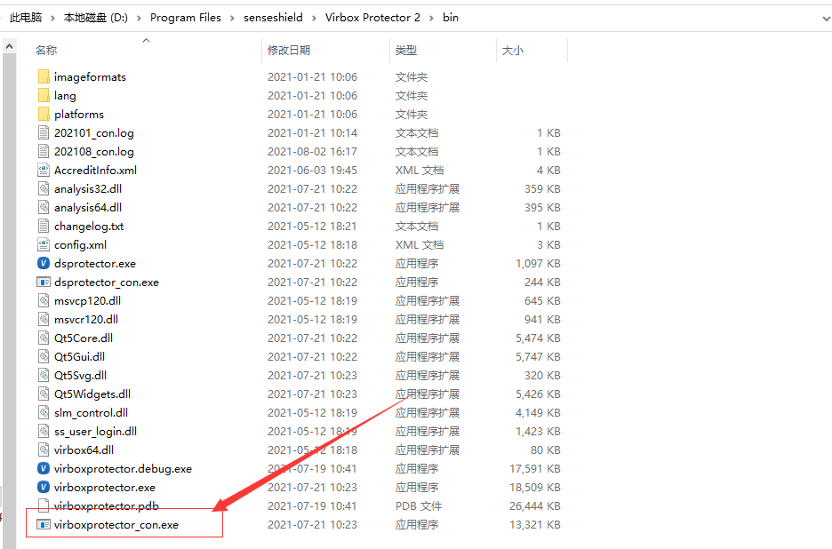

# Android apk 加密流程

## 方案简介

Virbox Protector Android 应用加固提供专业安全的防护，可防止 APK 被逆向分析、反编译、二次打包，防止嵌入各种病毒、广告的恶意代码，从源头上保护数据安全和开发者的利益。**Virbox Protector 2** 可以帮助应用开发者实现一键加固+自动签名等多种操作。

### 操作流程

- 将需要保护的 APK 文件导入**Virbox Protector 2 Trial** 中；
- 设置函数选项；
- 设置加密选项；
- 设置资源加密；
- 设置 SO 加密
- 执行加固；

------

## 登录

双击 **Virbox Protector 2 Trial** 快捷方式，启动应用，如果您尚未安装，请先下载：[下载](https://h.virbox.com/pages/viewpage.action?pageId=3414573) 

输入正确的账号&密码进行登录，如无账号，请先访问 https://shell.virbox.com/apply.html 进行注册。


## 导入文件

将 APK 导入至 **Virbox Protector 2 Trial 中。**

可通过以下两种方式将待加密的文件添加到 Virbox Protector。

```
1）直接拖入到 Virbox Protector
2）点击工具栏的【打开文件】，选择要加密的文件。
```

## 设置函数选项

Virbox Protector 可对 DEX 函数进行虚拟化保护。DEX虚拟化技术：对 DEX 中的 Dalvik 字节码进行虚拟化，转换为自定义的虚拟机指令，然后由 Native 层虚拟机解释执行。


## 加密选项设置


#### 输出信息

可设置保护后生成的文件命名及存储位置。

#### 设置选项

- DEX 加密是对 DEX 文件整体压缩加密（若在Google Play上架，不建议勾选dex加密，建议选择虚拟化方式保护dex文件里的函数）
- 勾选反调试按钮，则使用IDA等调试工具调试时，程序会直接退出。
- 勾选签名校验按钮，且进行签名设置，输入自己的 keystore 文件和密码（密钥别名和密钥密码选填）
- 勾选反注入，可以防止其它进程对 apk 或 aab 进程附加调试或注入。
- 勾选模拟器检测，可以防止程序在“夜神”、“雷电”、"AVD"等模拟器中运行。
- 勾选 root 检测，可以防止程序在 root 过后的手机上运行。
- 勾选多开检测，可以防止程序多开分身。

#### 签名设置

**启用签名：**

勾选启用签名，需要设置keystore路径和keystore密码，设置密钥别名和密钥密码，加密后会自动签名。

如果不勾选启用签名，加密后的apk/aab需要手动重新做签名。

:::tip **注意**

使用“签名校验”功能，必须勾选“启用签名”，才能保护成功。

:::

## 资源加密

加密APK 中的assets下的文件，支持图片、配置、脚本等文件类型。


## so库保护

```
点击 so 保护 选项，点击选择文件，添加待保护的so库。
【注】此方式选择的so库只有压缩功能，若有函数保护等需求，需要单独对so库进行保护。
```

:::tip **注意**

勾选“隐藏符号表”，so库需要全选，反之，so库若选择部分，“隐藏符号表”不建议勾选，否则运行可能会出问题。

:::


## 点击保护选中项目

```
设置完成后，点击【保护选中项目】，安装保护生成后的apk即可运行。
点击【保护选中项目】后，生成.ssp.apk 是加密后的apk文件。
```


## 命令行加密流程

### 1.生成 ssp 配置文件

使用 Virbox Protector 界面工具,按照上面的流程，配置 函数选项、加密选项、资源加密、SO保护，设置完成后，点击【保存所有配置】，即可生成 SSP 配置文件(若无配置文件，则命令行加壳后的apk默认不签名)；


### 2. 运行 virboxprotector_con

打开终端窗口，进入到“virboxprotector_con”所在的路径，直接输入“virboxprotector_con”运行可查看帮助信息；可在 Virbox Protector 快捷方式上，鼠标右键 选择 打开文件所在位置，即可进入到“virboxprotector_con”所在的路径



### 3. 执行命令加密 APK

```
// virboxprotector_con <需要被保护的so/apk/aar/aab> -o <输出文件的so/apk/aar/aab>
//示例
virboxprotector_con D:\Virbox\product\测试\apk\apk\SSRuntimeApiDemo.apk -o D:\Virbox\product\测试\apk\apk\SSRuntimeApiDemo.ssp.apk
```

