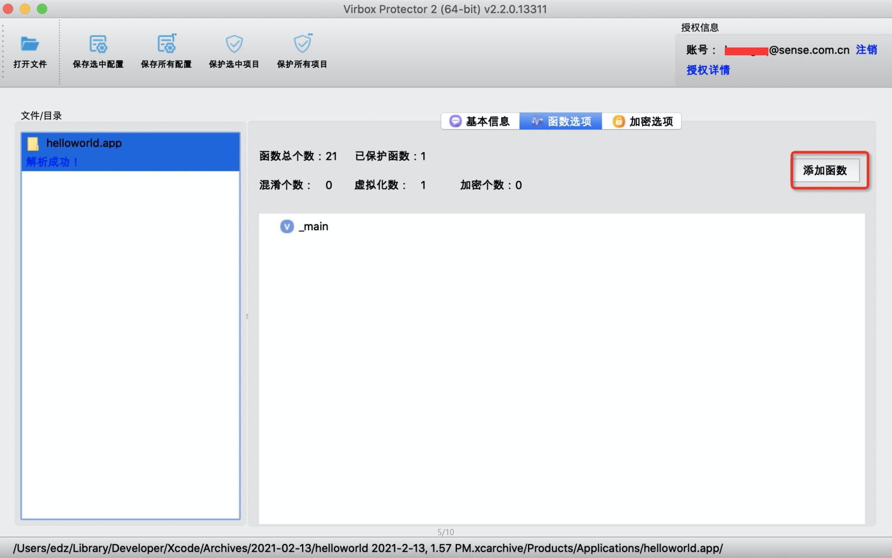
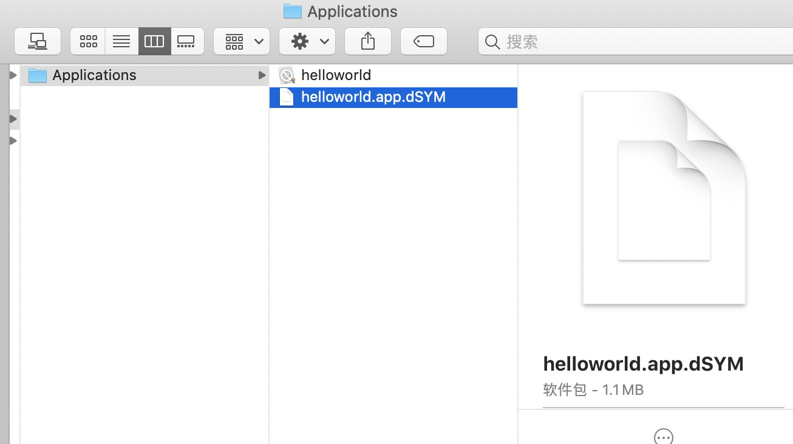

# iOS 加密流程

## 方案简介

深思数盾 iOS 应用加固通过对 iOS IPA 中的主程序进行加固，有效解决 iOS 应用存在的安全问题，保护应用免受破解、篡改等风险。

:::caution 温馨提示

- 建议在 Mac 电脑上对 ios 程序加密
- 要求IPA主程序编译时需要关掉 bitcode
- 可执行文件不能带fat头

:::

------

## 界面加密流程

本文以 helloworld.app 为例。

------

### 1、将程序拖入加壳工具

首先找到ios打包出来的应用所在的文件目录，将ios程序打包出来的应用（如：helloworld.app） 直接拖入加壳工具中（支持两种格式的识别，用户可以选择app格式的包文件，也可以直接使用app包中的可执行文件）


### 2、函数选项-添加函数

点击按钮函数选项-【添加函数】可以选择要保护的函数



可以选择想要保护的函数（代码混淆和代码虚拟化）


:::caution 注意

将dSYM文件放到app包所在的目录下，可以解析出函数名称；否则，函数将会只会显示地址。

:::

dSYM文件放置位置，如图所示：



### 3、加密选项设置

#### 输出信息设置：

输出文件夹：可设置加密后的程序存储的位置及命名

#### 设置选项

内存校验：可以针对应用程序防篡改

Objective-C 名称混淆：防止 objective-c class-dump dump 出方法名

反调试：可以检测调试器，防止动态调试

#### 签名设置

勾选启用签名，设置签名证书，会自动对程序做签名，并自动生成 ipa文件。

:::caution 注意

当前版本签名设置未生效，加固之后请用 iOS App Signer 签名

:::


### 4.点击保护选中项目

选择完成后，单机保护所选项目按钮，等待完成即可。


保护完成后，生成的文件

- helloworld.app     原文件
- helloworld.app.ssp  加密时生成的 ssp 配置文件，保存加密时所有设置选项。
- ssp.helloworld.app  加固后的文件
- ssp.helloworld.app.ipa  加固后自动生成的 ipa 包

## **命令行加壳**

**本文以 helloworld.app 为例。**

------

### 生成 SSP 配置文件

使用界面工具，设置函数选项、加密选项后，点击【保存所有配置】，即可生成 SSP 配置文件。如果不生成 SSP 文件，则无法对加固后的文件进行签名。


### 执行命令进行加固

找到 命令行工具 virboxprotector_con 文件位置：在应用程序中找到 Virbox Protector 2 Trial.app，打开包内容，在/Contents/MacOS/bin目录下就可以找到 virboxprotector_con。

打开终端窗口，进入到“virboxprotector_con”所在的路径，直接输入“virboxprotector_con”运行可查看帮助信息；

```
执行加固命令：virboxprotector_con helloworld.app -o ssp.helloworld.app
```

## 注意事项

1、加壳工具暂不支持bitcode，请在编译时关闭bitcode的编译选项，关闭方法如图所示：


2、加壳暂不支持FAT的格式，编译时请勿开启此模式,方法：ios部署目标选择11.0及以上的版本即可。


3、编译选项中，如果你的Debug Information Format（调试信息模式）选择的是 DWARF with dSYM File,请将dSYM文件放到app包所在的目录下。 调试信息模式选项如下图所示：

