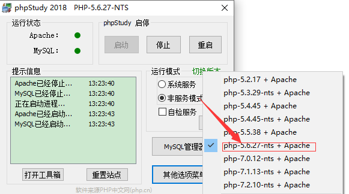
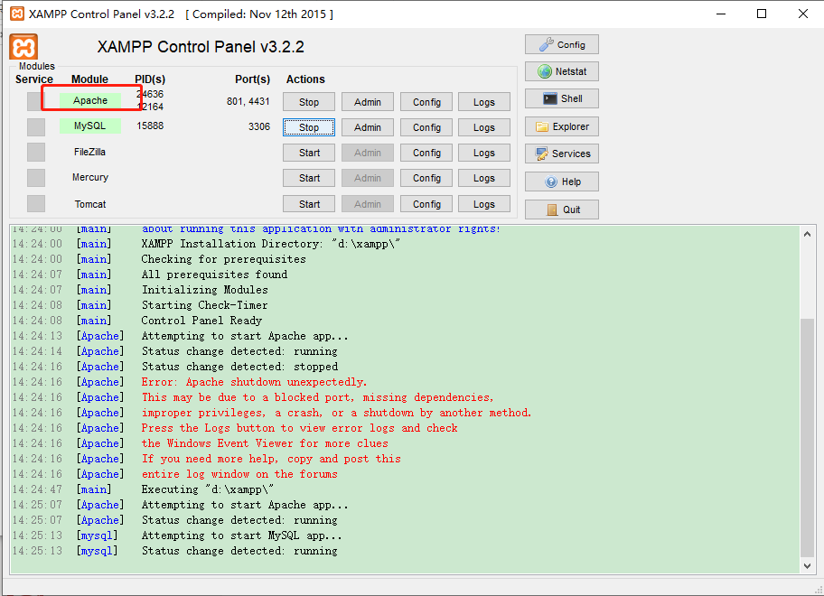
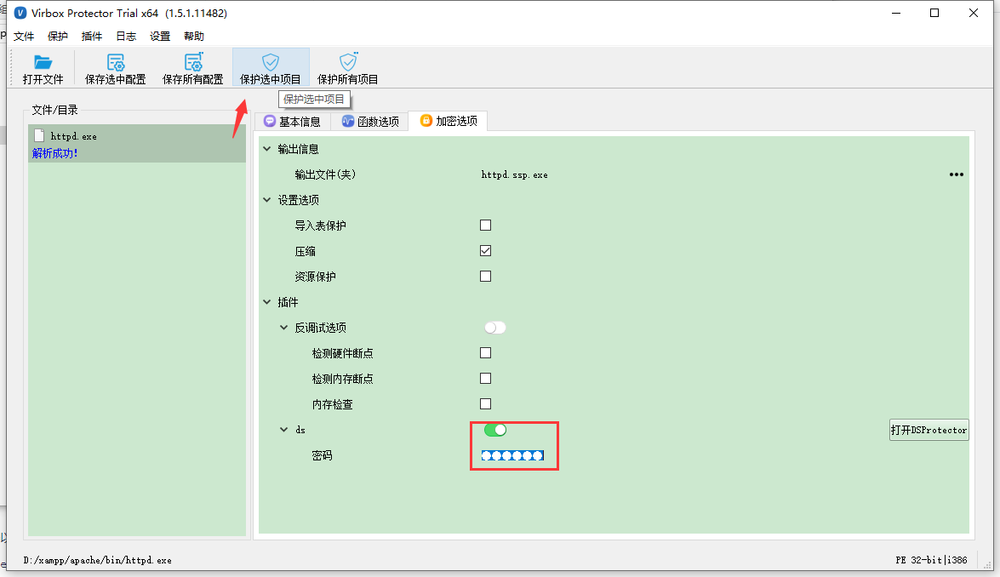

# PHP文件加密流程

## 部署Windows系统程序加密流程

不同的PHP调试环境，加密略有差异。下面主要介绍windows下phpstudy2018、xampp及phpstudy-pro三种环境的php文件加密。

### 不同环境的通用流程

1.用Virbox Protector对解释器(php-cgi.exe或httpd.exe)加密
2.用DSProtector对php加密
3.用加密后的解释器(php-cgi.exe或httpd.exe)替换原来的解释器
4.重启Apache服务，即可运行程序

### phpstudy2018

#### 1.加密php-cgi.exe

确认环境的php使用版本，打开对应的php环境目录下php-cgi.exe，将php-cgi.exe拖入到Virbox Protector中。

找到php环境目录下php-cgi.exe，将php-cgi.exe拖入到Virbox Protector中，设置加密选项，ds按钮打开，设置密码。

设置完成后，点击保护选中项目，生成两个文件：php-cgi.ssp.exe 和php-cgi.exe.ssp。

#### 2.打开DSProtector，对php文件加密。

点击加密选项页面的【打开DSProtector】，配置文件会自动加载生成的php-cgi.exe.ssp，将待加密的1.php拖入进来，点击开始保护，提示成功，php文件保护成功。

1.php加密成功后，会将源文件备份成1.php.bak，1.php则是加密后的文件，可使用编辑器查看1.php的代码变为乱码。

#### 3.替换php-cgi.exe

将加密后生成的php-cgi.ssp.exe,改名为php-cgi.exe,替换原来的php-cgi.exe

#### 4.重启phpstudy

替换php-cgi.exe后，点击重启phpstudy，即可运行加密的php文件。

### phpstudy-pro

与phpstudy2018的加密流程一致，找到使用的php版本的php-cgi.exe，后面流程一致。替换php-cgi.exe后，重启Apache服务。

### 小皮面板

与phpstudy2018的加密流程一致，找到使用的php版本的php-cgi.exe，后面流程一致。替换php-cgi.exe后，重启Apache服务。

### 宝塔面板

与phpstudy2018的加密流程一致，找到使用的php版本的php-cgi.exe，后面流程一致。替换php-cgi.exe后，重启Apache服务。

### XAMPP

使用XAMPP环境的php项目，服务使用apache，需要对httpd.exe进行加密替换。

#### 1.找到apache文件夹下的httpd.exe，加密httpd.exe

将httpd.exe拖入到Virbox Protector中，加密选项处【ds】按钮打开，设置密码，然后点击【保护选中项目】

点击保护选中项目，会生成httpd.exe.ssp 和httpd.ssp.exe.

#### 2.加密php文件

点击【打开DSProtector】，配置文件会自动加载httpd.exe.ssp，将php文件拖入，点击开始保护，提示成功

index1.php加密成功后，会将源文件备份成index1.php.bak，index1.php则是加密后的文件，可使用编辑器查看index1.php的代码变为乱码。

#### 3.替换httpd.exe

将加密后生成的httpd.ssp.exe,改名为httpd.exe,替换原来的httpd.exe

#### 4.重启apache服务

在xampp面板，将Apache服务stop，然后start。即可运行加密后php文件。

### wampserver服务

场景：wampserver是Apache Web服务器、PHP解释器以及MySQL数据库的整合软件包，在Windows系统上使用wampserver软件包运行PHP程序，如何使用DSProtector加密呢？

1、运行原始程序，借用Procmon监测工具监测调用`checkbox.php`的进程为`httpd.exe`。

2、查到`httpd.exe`的位置。

3、对进程`httpd.exe`加壳保护。

在加密选项处，打开ds按钮，设置一个密码，然后点击保护程序。加壳成功后，生成httpd.exe.ssp  和  https.ssp.exe

将httpd.ssp.exe  重命名为  httpd.exe ，替换环境中的 httpd.exe，然后重启服务。

4、对资源文件进行加密保护。

打开 DSProtector 资源加密工具，

保护成功后，正常运行即可。

### IIS服务

场景：在Windows系统上通过IIS服务启动PHP页面。

1、在`控制面板-管理工具-IIS`打开IIS服务页面，可以看到调用PHP主进程的是php-cgi.exe。

2、启动服务后，可以在任务管理器中进程并找到其位置。

使用Virbox Protector工具对php-cgi.exe进行加壳，使用DSProtector对PHP资源文件进行加密。

## 部署Linux系统程序加密流程

### Apache服务

场景：Linux系统上使用apache和PHP服务环境，如何使用DSProtector加密呢？

#### Ubuntu

1、启动Apache服务后，查看服务状态，可以看到apache2服务进程的位置及PID。

2、使用Virbox Protector工具对进程文件进行加壳保护。

加密选项处，需要打开ds按钮，设置密码（密码可自己设置）

apache2-src 加壳后，会生成 apache2-src.vp ,需要去掉 .vp 替换原来的 apache2-src.

3、使用DSProtector工具对资源文件进行加密。若DSProtector工具是以普通用户权限启动，则对root权限的文件直接加密会失败。

4、将加壳后的进程文件和加密后的php文件放回程序原来的位置，重新启动Apache服务 。

#### CentOS

1、启动Apache服务后，查看服务状态，可以看到httpd服务进程的位置及PID。

2、使用Virbox Protector工具对httpd进程加壳保护。使用DSProtector工具对资源文件进行加密。

3、若DSProtector工具是以普通用户权限启动，则对root权限的文件直接加密会失败。

### php-fpm服务

场景：使用nginx服务和php-fpm服务运行PHP文件。

1、启动php-fpm服务后，查看服务状态，可以看到服务进程的位置及PID。

2、使用Virbox Protector工具对php-fpm进程加壳保护。使用DSProtector工具对资源文件进行加密。

3、若DSProtector工具是以普通用户权限启动，则对root权限的文件直接加密会失败。

### 宝塔面板

场景：使用Nginx+php服务

1.找到宝塔面板软件安装目录。进入使用的php版本的php目录，找到php-fpm:

2.使用 Virbox Protector 工具对 php-fpm 加壳保护。使用DSProtector工具对 php 进行加密。将加壳后的php-fpm和加密后的php文件放回程序原来的位置，重新启动Apache服务 。

