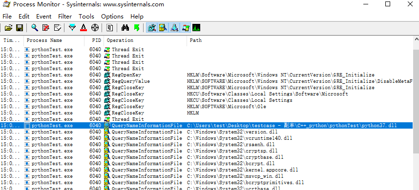

# Python加密流程

## 保护背景

Python语言写的程序无需编译成二进制文件代码,可以直接从源代码运行程序。在计算机内部, Python解释器把源代码转换成字节码的中间形式,然后再把它翻译成计算机使用的机器语言并运行,这使得 Python程序更加易于移植。使用Virbox Protector 可以对python程序进行加密保护，防止反编译。

## 支持范围

若不符合以下列表中场景的用户，可以联系**深思客服**详细咨询。

| **场景**                          | **是否支持** |
| --------------------------------- | ------------ |
| Anconda2/Anconda3                 | 支持         |
| C++/C语言文件中调用python         | 支持         |
| py文件中调用C++/C                 | 支持         |
| pyinstall/py2exe将py文件打包成exe | 支持         |
| py文件转成的pyd/SO/可执行文件     | 支持         |

## 打包成exe/pyd/so加密流程

:::tip 提示

pyinstall/py2exe将py文件打包成exe 及py文件转成的pyd/SO/可执行文件 都可以参考 [本地程序保护流程](../客户端应用保护/本地程序保护流程)

:::

## 对.pyc或者.py文件进行保护

### 1 . 查找Python.exe（windows环境部署）

运行python程序，可在任务管理器中查找py/pyc文件调用的主进程。

### 2. 对python.exe 进行加密。

对安装环境 Python 路径下的 python.exe 进行加密。

将 python.exe 拖入到加壳工具Virbox Protector 中。

**配置加密选项**

将加密选项中的 DS 开关打开，并设置密码。

【一般情况下，密码可随意设置（随机生成，已经过加密处理）】

点击“保护选中项目”，加壳后会额外生成图示两个文件。

python.exe.ssp 是配置文件，在后面对 .py/.pyc 加密时会用到；

python.ssp.exe 是加壳后的 python.exe 文件，将 python.exe 剪切到其他文件夹备份，python.ssp.exe 名字改为python.exe 即可。

### 3. 对 .py/.pyc进行保护

打开“DSProtector.exe”对 .py/.pyc进行保护。

添加上一步加密 python.exe 生成的 python.exe.ssp 文件。添加要加密的 .py/.pyc文件。

点击“开始保护”，加密成功。

加密后的文件名为源文件名称，.bak 文件为自动备份的源文件，软件发布前需删除bak 文件。

:::tip 提示

如果不想在当前目录生成bak文件，可先设置默认输出目录，会将加密后的资源文件输出到设定的目录

:::

至此，Python 的 .pyc /py文件已经加密成功。

## C++文件中调用python文件

场景：在Windows系统上，使用C++语言的文件中调用py文件，将C++文件打包成exe后，应该如何保护？

以python3.7为例：

1、使用Procmon.exe查看打包后的exe运行所依赖的文件，可以看到是python37.dll。

2、然后使用Virbox Protector工具对python37.dll进行加壳，使用DSProtector对py文件进行加密，加密操作完成后，即可操作运行。

## 如何加密Linux部署的python程序

场景：直接命令行中运行python文件。

1、命令行直接执行py或pyc文件，比如：python demo.py或python demo.pyc。

2、查找py/pyc文件调用的主进程。

3、找到主进程后，再依次使用Virbox Protector工具对主进程加壳，DSProtector对py/pyc文件进行加密，加密操作完成后，程序可以正常运行。

python3  使用 Virbox Protector 加密后，会生成 python3.vp 和 python.ssp

python3.vp   是加密后的python3 ，需要将 .vp 去掉，替换linux环境里的 python3

python3.ssp 是生成的 ssp配置文件，配合 DSProtector 对py/pyc 加密即可。